# LK Note 00
> SJTU-CS353 Linux Kernel

> Refer to the slides of Prof. Quan Chen, Dept. of CSE, SJTU.
## Process Management on Multi-processor System: Scheduling Domain
* 单 CPU 上的进程调度
    * CPU 使用 `schedule()` 函数从本地 runqueue 中挑选进程运行
    * 考虑的是进程对 CPU 使用的需求，通过设置 priority 实现
* 多 CPU 上的进程调度
    * 一个 CPU 只从本地 runqueue 中挑选进程，一个可运行进程只在一个队列中存在
    * 内核周期性检查各 CPU 运行队列是否平衡，必要时将进程迁往其它队列
    * 考虑的是各 CPU 的**负载均衡**，通过**调度域**实现
### （1）调度域的组成
* 调度域是一个 CPU 集合，这些 CPU 的工作量由内核保持平衡
* **调度域分级组织**
    * 每一级包含具有相同属性的 CPU（同一个物理核，同一个 NUMA 节点）
    * 每一级 CPU 之间进行负载均衡的开销不同
        * 同一物理核的逻辑 CPU < 不同物理核的逻辑 CPU
        * 同一 NUMA 节点的 CPU < 不同 NUMA 节点的 CPU
    * 内核自下而上进行 CPU 负载均衡（优先进行开销小的均衡）
    * 考虑一个 2 sockets 的机器（2 NUMA nodes），每个 socket 上安装了一块 2 cores 的处理器，每个物理 core 支持 2-SMT 超线程
        * *SMT（Simultaneous Multithreading，同步多线程），在一个 CPU 的时钟周期内执行来自多个线程的指令的硬件多线程技术。本质上，SMT 是一种将多 CPU 上的 TLP 转化为单 CPU 上的 ILP 的方法。SMT 是单 CPU 从多个硬件线程上下文同时分派指令的能力*

<p align="center">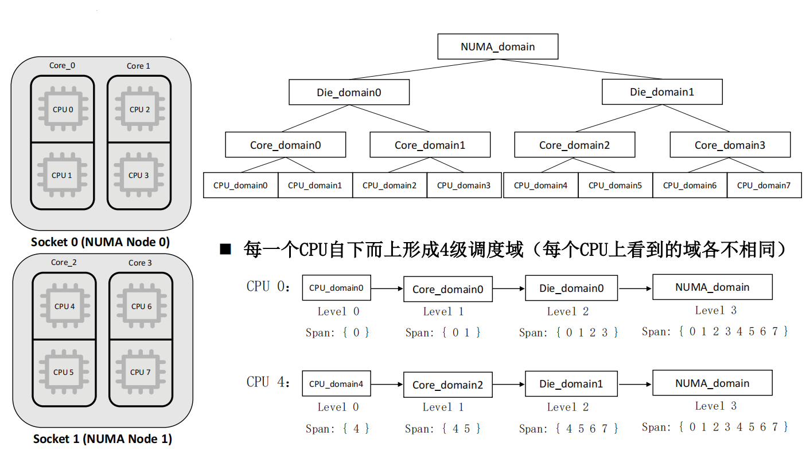</p>

### （2）基于调度域的负载均衡过程
* 每个调度域被划分为一个或多个**调度组**，每个组是该域 CPU 集合的一个子集
* 负载均衡是在调度组之间完成的
* 负载均衡过程
    * 注册软中断 `SCHED_SOFTIRQ`，当一个 CPU 的软中断触发时，**该 CPU** 检查是否需要进行负载均衡
    * 该 CPU 从最底层调度域开始，自下而上遍历调度域（保证各层级组间负载均衡）
    * 计算该层域内所有调度组的平均负载，找到最繁忙的调度组，以及该组最繁忙的队列
    * 若本 CPU 在该域中**所在调度组平均负载**低于最繁忙的组，**从最繁忙的队列中迁移一些进程到本 CPU 上**

<p align="center">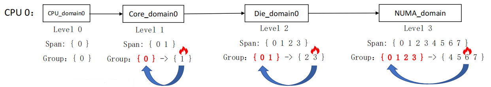</p>


## Power Management: From Linux Kernel to Android

### （1）Linux 电源管理

* 两种电源管理标准：
  * 高级能源管理（APM，Advanced Power Management）
  * 高级配置和能源接口（ACPI，Advanced Configuration and Power Interface）
* **高级能源管理（APM）**
  * 由 BIOS 控制，通过活动超时来确定何时关闭设备
  * 两种方式：
    * 从 APM 驱动程序发起函数调用，向 BIOS 请求更改电源状态 
    * 根据设备的活动自动进行管理

<p align="center">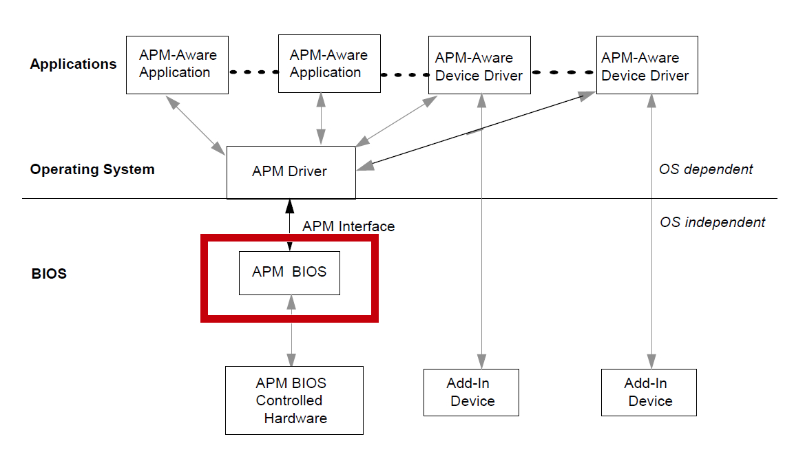</p>

* **APM 中的电源状态**：设备响应度由高到低、能耗由高到低
  * Full On
  * APM Enabled（开启节能）
  * APM Standby（待机）
  * APM Suspend（挂起）
  * Sleep/Hibernation（睡眠）
  * Off
* **高级配置和能源接口（ACPI）**
  * 由 BIOS 和 OS 协同完成，通过 OS 进行调整决策
  * **4 种全局状态 G，6 种睡眠状态 S**：设备响应度由高到低、能耗由高到低
    * **G0**（S0）**：Working**，包括离开模式（awaymode）
    * **G1：Sleeping**
      * S1：CPU 和 RAM 持续供电，不使用的 devices 停止供电。刷新 CPU 的 Cache，CPU 停止执行指令
      * S2：CPU 停止供电，将 dirty cache 刷新到 RAM 中
      * S3：待机，系统挂起到 RAM，只有 RAM 在供电
      * S4：休眠，挂起到磁盘，RAM 停止供电，全部保存到非易失性存储器（硬盘）上，并断电
    * **G2**（S5）**：Soft Off**（网卡供电，可通过网络唤醒机器）
    * **G3：Mechanical Off**（彻底断电）
    * Legacy State：OS 不支持 ACPI 的状态，实际上已经禁用了 ACPI

<p align="center">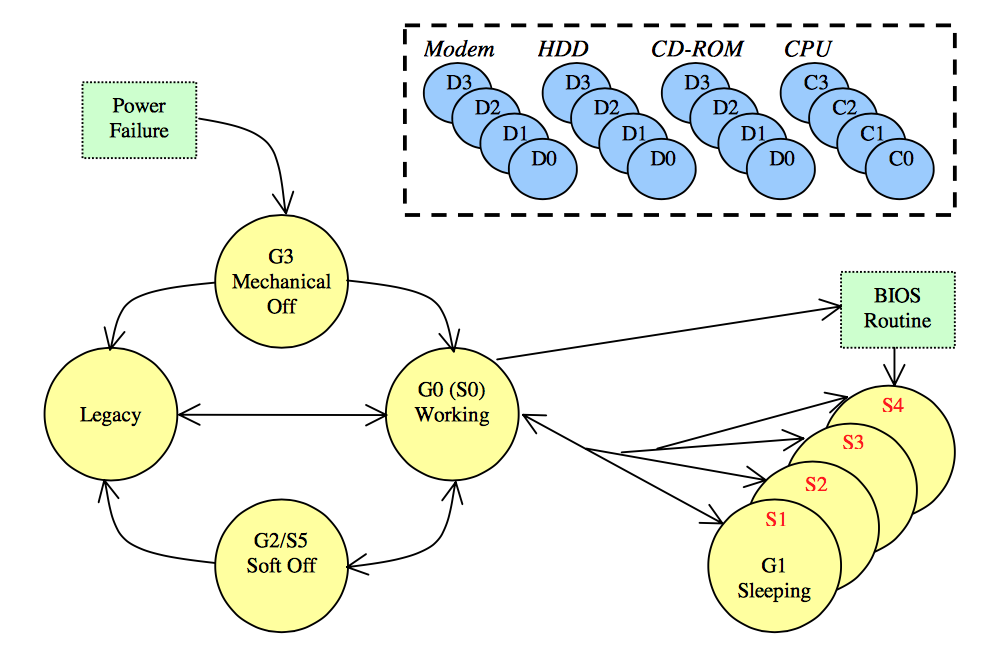</p>

* **Linux 电源管理命令**
  * 电源模式接口在 sysfs 中（虚拟文件系统）：`/sys/power/state`

    ```shell
    echo standby > /sys/power/state
    echo mem > /sys/power/state -S3
    ```

<p align="center">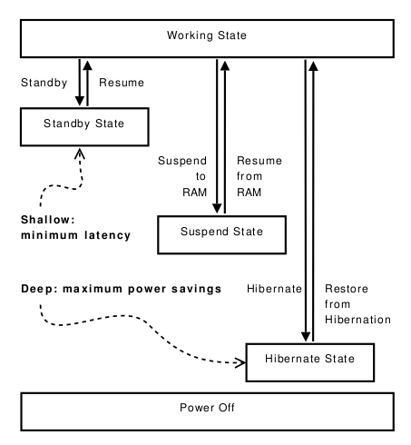</p>

### （2）Android 电源管理

* Android 电源管理为移动设备（默认处于关闭状态）设计，建立在 Linux 电源管理之上，目标是延长电池寿命
* 应用程序和服务，必须通过 Android 应用程序框架和本机 Linux 库使用**唤醒锁（Wake Lock）**来请求 CPU 资源，以保持通电，否则 Android 关闭 CPU
* Android 电源管理使用**唤醒锁**和**超时机制**来切换系统电源状态，从而降低系统能耗
* 唤醒锁分为
  * **完全唤醒锁**（Full Wake Lock）：包括 CPU、LCD 屏幕、键盘等
  * **部分唤醒锁**（Partial Wake Lock）：仅 CPU
* **Android 电源管理架构**
  * 用户空间的应用程序，使用电源管理框架的 PowerManger Java 类，来控制设备电源状态
  * 创建、获取唤醒锁，执行操作，释放唤醒锁
  * 若没有活动的唤醒锁，CPU 会被关掉；若有部分唤醒锁，屏幕和键盘会被关掉

<p align="center">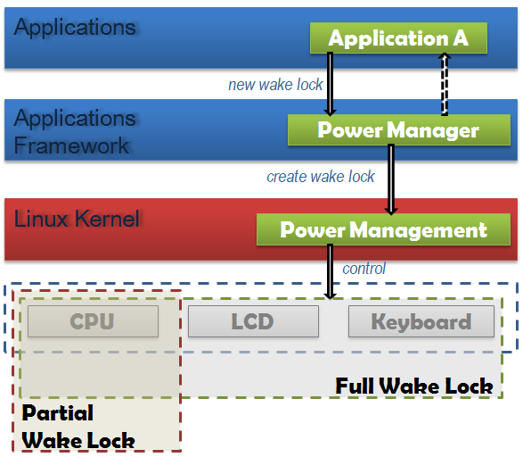</p>

* **电源管理状态机：AWAKE / NOTIFICATION / SLEEP 三态**
  * 获得完全唤醒锁 or 发生屏幕/键盘触摸活动事件  ->  AWAKE 状态
  * 超时 or 按下电源键  ->  NOTIFICATION 状态
    * 获得部分唤醒锁  ->  保持 NOTIFICATION 状态
    * 释放所有部分唤醒锁  ->  SLEEP 状态

<p align="center">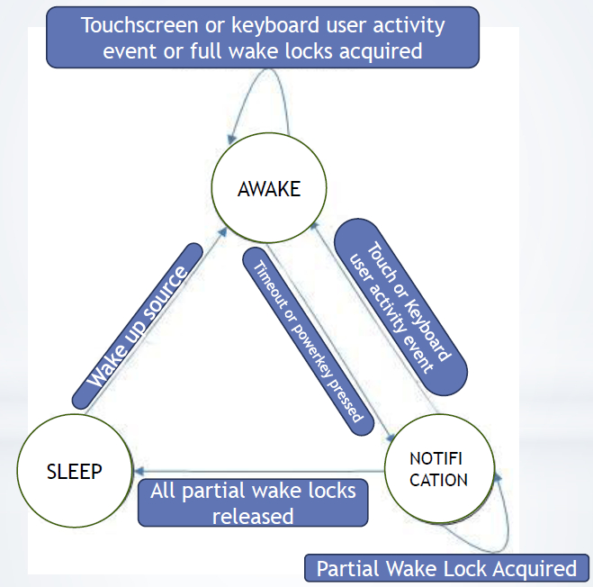</p>

* **内核唤醒锁**：内核中一个 Full Wake Lock，一个 Partial Wake Lock，用于防止系统进入挂起或低功耗状态，可以从内核获取/释放

### （3）预挂起 & 后唤醒

* 内核挂起前，首先调用**预挂起（Early Suspend）**，用于关闭屏幕等能耗大的设备
* 内核唤醒后，最后调用**后唤醒（Late Resume）**，用于开启屏幕等能耗大的设备
* 有助于进一步节能
* 任何驱动程序都可以注册自己的预挂起和后唤醒处理程序

<p align="center">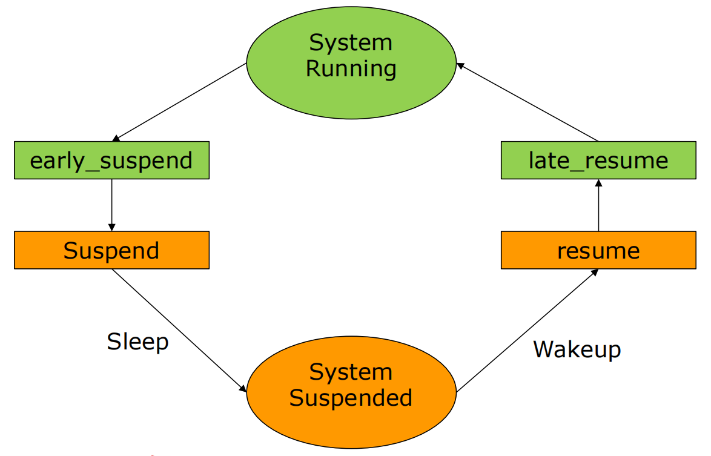</p>

## New Directions of Operating System Kernel

* 内核分类：
  * 宏内核（Monolithic Kernel）
  * 微内核（Microkernel）
  * 外核（Exokernel）
  * 单内核（Unikernel）
  * 多内核（Multikernel）

<p align="center">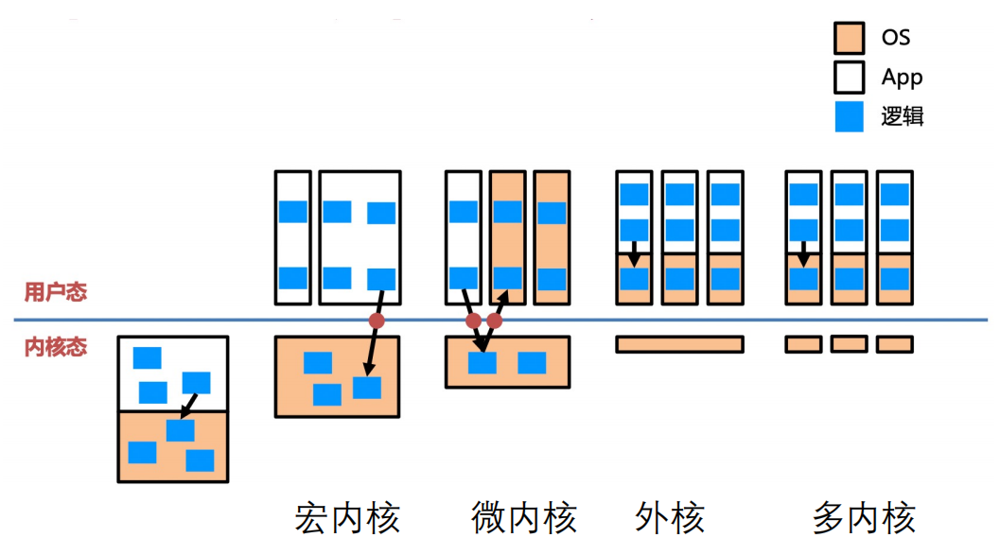</p>

* **宏内核：**所有的内核代码编译成一个二进制文件，运行在一个大的内核地址空间中。内核代码可以直接访问和调用，效率高、性能好

<p align="center">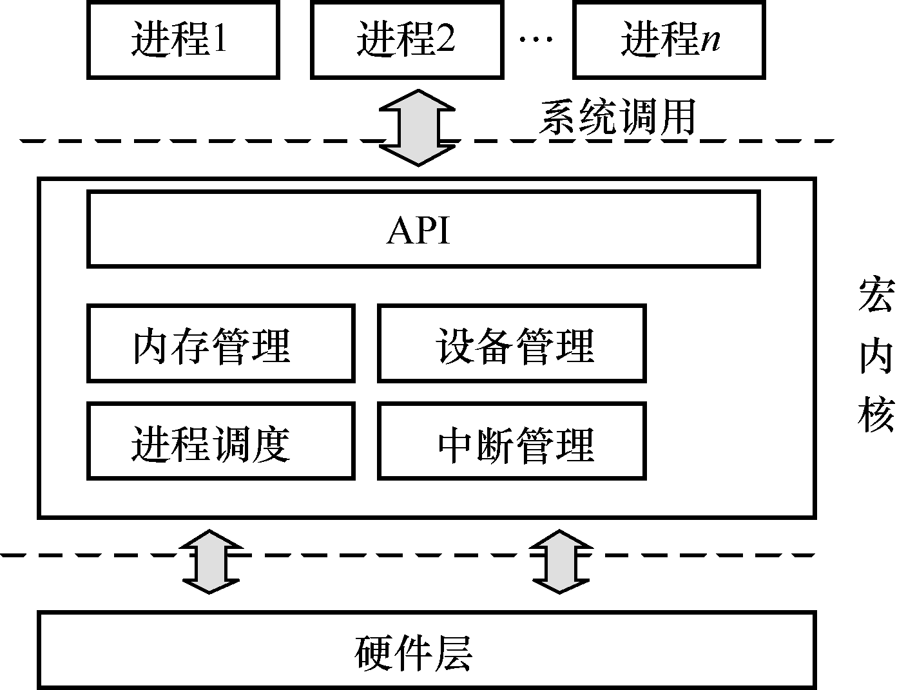</p>

* **微内核：**把 OS 分成多个独立的功能模块（类似 microservice），模块之间的通信通过消息来完成（通信性能差，需要硬件支持）

<p align="center">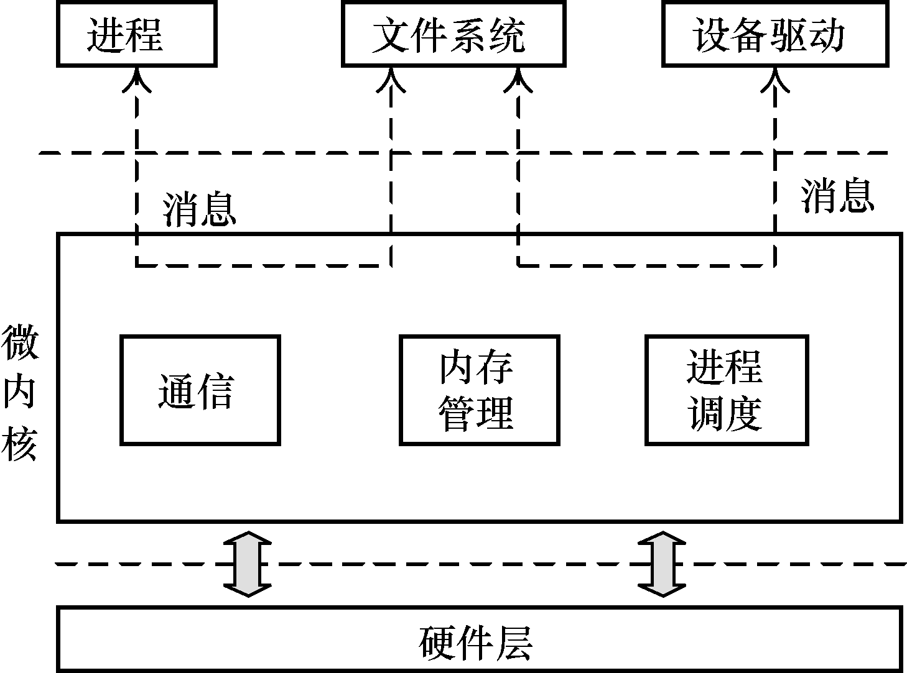</p>

* 微内核的优缺点
  * 优点
    1. 易扩展：直接添加一个用户进程，即可为 OS 添加服务
    2. 易移植：大部分模块与底层硬件无关
    3. 更可靠：在内核模式运行的代码量大大减少
    4. 更安全：即使存在漏洞，服务之间也存在进程粒度隔离
    5. 更健壮：单个模块出现问题，不会影响系统整体
  * 缺点：
    1. 性能差：内核中的模块交互由函数调用变成了进程间通信
    2. 生态差：尚未形成 Linux 这样的具有广泛开发者的社区
    3. 难兼容：重用宏内核 OS 提供兼容性，但带来新问题
* **外核 Exokernel + LibOS** 
  * **Exokernel 不提供硬件抽象**，只有应用才知道最适合的抽象（end-to-end 原则）
  * **Exokernel 不管理资源，只管理应用**
    * 负责资源与应用之间的绑定（Resource Binding），以及资源的回收
    * 保证多个应用之间的隔离
    * **OS = 服务应用 + 管理应用**
      * **服务应用：LibOS，用户态**
      * **管理应用：Exokernel，内核态**
  * Exokernel 的功能：追踪资源的拥有权，保证资源的保护，回收对资源的访问权（应用管理的角色）
  * **End-to-End —— 将 LibOS 与 Resource 绑定**
    * 可用性：允许某个 LibOS 访问某些 Resource
    * 隔离性：防止这些资源被其它 LibOS 访问
  * **LibOS**
    * 策略与机制分离：对硬件的抽象以库的形式提供
    * 高度定制化：不同应用使用不同的 LibOS，或完全自定义
    * 更高性能：LibOS 与应用的其它代码之间通过函数调用直接交互
  * 优缺点
    * 优点：
      * OS 无抽象，能在理论上提供最佳性能
      * 应用对计算有更精确的实时控制
      * LibOS 在用户态更易调试，调试周期更短
    * 缺点：
      * **对计算资源的利用效率主要由应用决定**
      * 定制化过多，导致维护难度增加

<p align="center">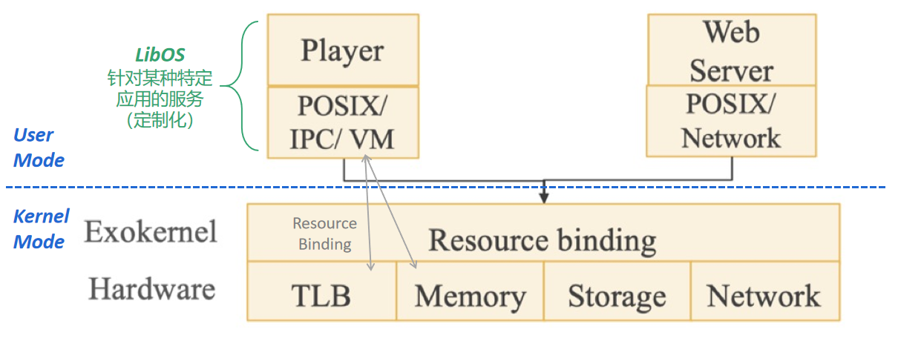</p>

* **单内核 Unikernel**
  * 虚拟化环境下的 LibOS
    * 每个虚拟机都使用内核态：运行一个应用 + LibOS
    * 通过虚拟化层实现不同实例之间的隔离
  * 适合容器（Container）等新的应用场景
    * 每个容器是一个虚拟机，运行定制的 LibOS 来提高性能
* **多内核 Multikernel**
  * OS 内部需要维护很多共享状态，多内核的思路是划分而不是共享：维护多份状态的 Copy
  * 显式的核间通信机制，每个 core 上运行一个小内核（CPU/GPU/...），整体上 OS 是一个分布式系统，应用程序依然运行在 OS 上

<p align="center">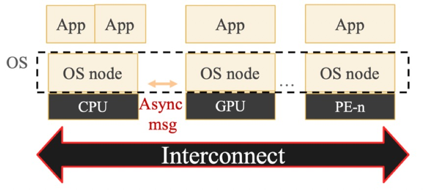</p>
