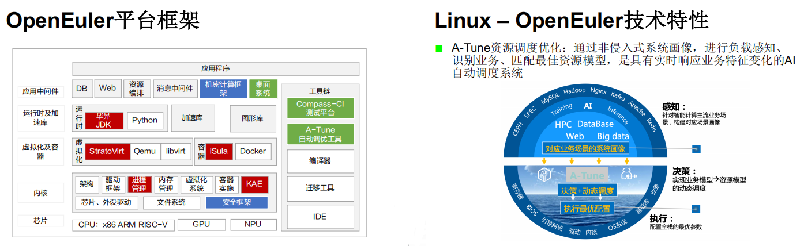
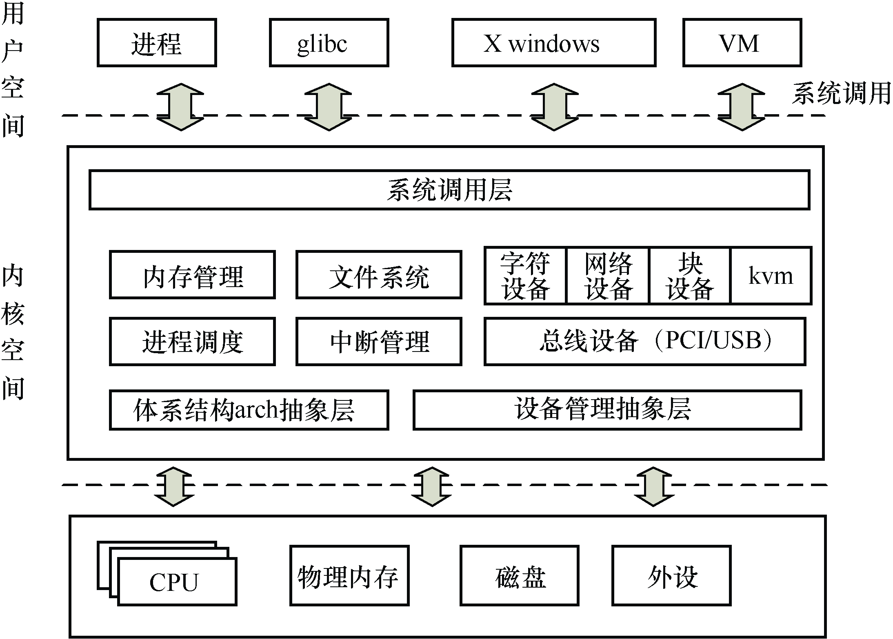
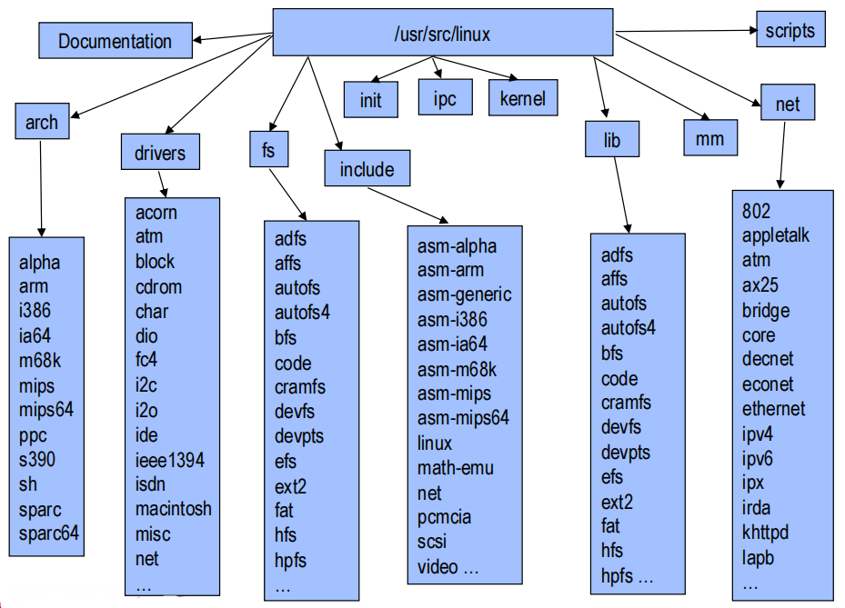

# LK Note 01
> SJTU-CS353 Linux Kernel

> Refer to the slides of Prof. Quan Chen, Dept. of CSE, SJTU.
## Lec 1. Introduction to Linux Kernel
### （1）What is Linux ?
* UNIX-like OS
* Features:
    * 抢占式多任务（preemptive multitasking）
    * 虚拟内存（virtual memory）、分页机制（paging）
    * 共享库（shared libraries）
    * 对称多处理支持（symmetric multi-processing）
    * 按需加载的模块（demand-loading kernel modules）
    * 写时拷贝（copy-on-write，shared page between parent and child）
    * TCP/IP 网络（TCP/IP networking）
    * 开源（open source）
### （2）Linux 现状

* **Linux 发行版（Distribution）**
    * **Red Hat 系列**
        * CentOS、Fedora Core 等
    * **Debian 系列**
        * Debian、Ubuntu 等
        * 特有的 apt-get/dpkg 软件包管理工具
    * ***Huawei OpenEuler***

### （3）What is Linux Kernel ?
* **Linux 两种运行模式**：用户态、内核态

* **Linux Kernel 功能**：
    * 执行体、系统监视器
    * 控制对硬件资源的访问
    * 实现文件和设备的基本抽象
        * process/file/devices/...
    * 调度和分配系统资源
        * memory/CPU/disk/descriptors/...
    * 增强系统的安全性
    * 响应用户的服务请求：syscall

* **Linux Kernel 设计目标**
    * performance, efficiency, speed, utilize resources to capacity with low overhead
    * robustness, resilience, graceful degradation
    * features, flexibility
    * security, protect user from each other & system from bad users
    * scalablity, compatiblity

* **微内核（Microkernel）**：把 OS 分成多个独立的功能模块，模块之间的访问通过消息来完成（HarmonyOS）

* **宏内核（Monolithic Kernel）**：把所有的 Kernel 代码编译成一个二进制文件，运行在一个大的内核地址空间中，Kernel 代码可以直接访问和调用，效率高、性能好（**Linux**）
    * Linux Kernel 设计融合了宏内核和微内核的优点：模块化设计、抢占式内核、动态加载的内核模块

### （4）Linux 源码树
* **Linux 源码树结构**（`/usr/src/linux` 2.6 or earlier）

* **[Linux 源代码解析]()**

* **[Linux 系统代码解析（安装后）]()**