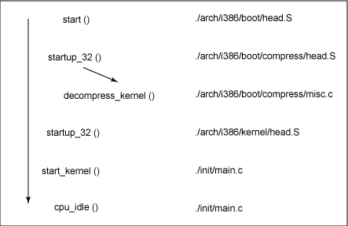

# LK Note 02
> SJTU-CS353 Linux Kernel

> Refer to the slides of Prof. Quan Chen, Dept. of CSE, SJTU.
## Lec 2. Linux Booting

### （1）系统启动（System Startup）
* **Boot Sequence** 是计算机加载操作系统的一系列操作
    1. Turn on
    2. CPU 跳转到特定 BIOS 地址（ROM 预加载到 RAM 0xffff0）
    3. BIOS 运行 POST 指令（Power-On Self Test）
    4. 寻找可启动设备（e.g. 磁盘）
    5. 从 MBR 中加载和执行启动扇区
    6. 加载 OS

* **BIOS（Basic I/O System）**
    * 计算机加电启动后，首先执行的软件代码段
    * 嵌入在主板上的特定芯片中
    * 功能：识别和控制组成计算机的各种设备

### （2）引导加载程序（BootLoader）
* **主引导记录（Master Boot Record，MBR）**
    * OS 从包含 MBR 的硬盘启动，而 MBR 包含 Master BootLoader（主引导加载程序）
    * **MBR 是一个 512 B 的扇区，位于磁盘的第一个扇区**
        * 如果一个硬盘的主引导扇区有故障，不能作为启动盘，但可以作为数据盘
    * MBR 加载到内存后，BIOS 将控制权交给 MBR

* **MBR 结构**
    * 前 446 字节 —— **引导加载程序**（BootLoader），包含可执行的代码，以及错误信息
        * 又称：Kernel 加载程序，主要任务是将 Linux Kernel 加载到内存中
        * 常见 Linux BootLoader：**GRUB**、**LILO**
    * 64 字节 —— **磁盘分区表**，4 个分区中每一个均有一个记录项
    * 2 字节 —— **Magic Number**（0xaa55/0x55aa），检查 MBR 的有效性

* **GRUB**
    * 与 OS 无关的 BootLoader
    * 启动流程
        * 从 Boot Sequence 的第 4 步 —— 寻找可启动设备开始

| 阶段 | 控制权 | 描述                                                                                              |
| ---- | ------ | ------------------------------------------------------------------------------------------------- |
| 1    | BIOS   | BIOS 寻找可启动设备，将计算机控制权交给 MBR                                                       |
| 2    | MBR    | GRUB 阶段 1 ：由于 MBR 非常小（446 B），阶段 1 仅仅加载 GRUB 下一阶段的代码                       |
| 3    | MBR    | GRUB 阶段 1.5 ：阶段 1.5 代码位于硬盘上紧接着 MBR 后面的 30 KB 空间中，阶段 1.5 加载阶段 2 的代码 |
| 4    | GRUB   | GRUB 阶段 2 ：得到计算机的控制权，向用户显示 GRUB 启动菜单，用户可以手动指定启动参数              |
| 5    | Kernel | GRUB 加载用户选择的/默认的 Kernel 到内存中，将控制权交给 Kernel                                   |

### （3）内核加载
* **内核映像（Kernel Image）**
    * Kernel 常驻内存，直到关机
    * Kernel Image 不是一个可执行的 Kernel，而是一个压缩后的文件
        * Kernel Image 读取到内存后快速解压
        * 如果不压缩，则文件较大，读取时间长，而且嵌入式设备空间不足
        * zImage、bzImage 压缩后分别小于、大于 512 KB
    * 主要函数调用流程

### （4）用户态启动：启动更多服务进程
* 三种启动方式：SysV、Upstart、Systemd

* **Sys-V**
    * **init 进程（1 号进程）**
        * 注意：idle 进程为 0 号进程（以前为 scheduler）
        * **init 进程是 Linux 中所有进程的根进程**（进程树的根节点），用来启动所有其它进程，关机时控制其它进程的回收顺序（处理父子进程依赖关系）
        * init 进程启动的第一个进程是：`/etc/rc.d/rc.sysinit`（启动守护进程）
        * 基于合适的运行级别，开始执行不同的脚本启动各种进程
            * init 进程启动 `/etc/inittab` 文件中所有需要启动的系统进程

    * **运行级别（Run-level）**
        * `/etc/rc.d/rc#.d` 脚本（0-6）
            * 给定的运行级别，在启动和关闭时，运行的脚本文件
            * Run-level：3 —— `rc3.d` —— 多用户、命令行界面
            * Run-level：5 —— `rc5.d` —— 图形界面

    * **`init.d` 目录**
        * **守护进程（Daemon）**：后台运行的进程
        * 管理员可以改变 `init.d` 目录的内容，来启动/停止特定的守护进程 
        * `/etc/rc.d/init.d` or `/etc/init.d`

* **Upstart** for Ubuntu
    * Event-Driven
    * Upstart 在感知到事件后触发相应等待任务，可以更快地启动系统，新硬件被发现时动态启动服务，硬件被拔除时动态停止服务

* **Systemd**
    * 管理其它守护进程的守护进程
    * 替代 SysV 和 Upstart，提高启动速度
        * 大多数 Linux distribution 开始使用该方式，兼容 SysV
        * **按需启动**，尽可能启动更少的进程，尽可能并行启动多个进程
    * 核心组件
        * systemd：Linux 的服务管理器
        * systemctl：监测和控制 systemd 的状态
        * systemd-analyze：检查系统启动性能以及统计信息
    * Systemd 使用 Target 代替了 Run-level 的概念，有 SysV Run-level 和 Systemd Target 的对应关系，例：
        * 3 <-> multi-user.target（多用户、命令行）
        * 5 <-> graphical.target（多用户、图形化）

### （5）Linux Booting 源码分析
* Linux 源码中的汇编代码（x86）
    * 完全的汇编代码：`.S` 文件
    * 嵌入在 C 程序中的汇编代码
    * x86 汇编采用 AT\&T 格式：小写字母，寄存器名以 \% 为前缀，源操作数在前，目标操作数在后
    * 访问内存指令的操作数大小：b（8）、w（16）、l（32）
    * 直接操作数以 \$ 作为前缀

* Linux Booting 指从系统加电到控制台显示登录的运行阶段，主要相关代码在 `arch/i386/boot` 中
    * `bootsect.S`：Linux 引导扇区源码
    * `setup.S`
    * `video.S`
    * `compressed/`
        * `head.S`、`misc.S`：用于 Kernel Image 的解压缩
    * 经过编译、汇编、链接形成 3 个部分：引导扇区映像 bootsect、辅助程序 setup、内核映像
    * 小映像 zImage，大映像 bzImage