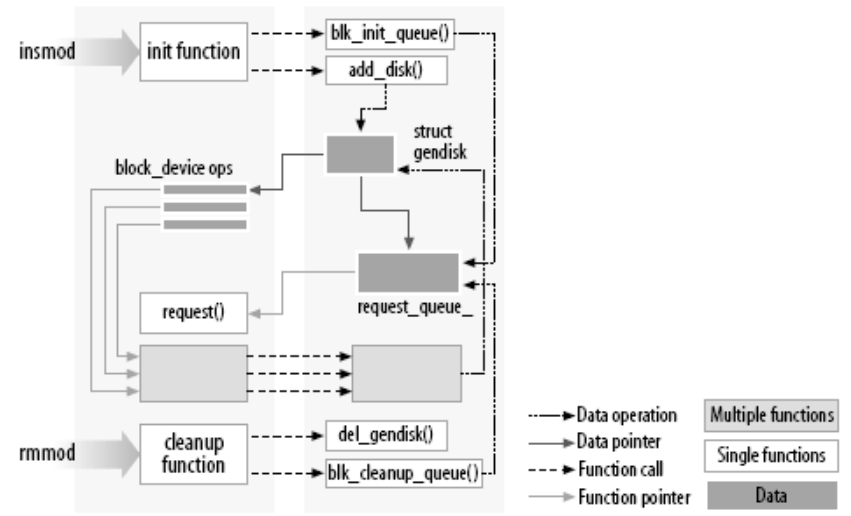

# LK Note 03
> SJTU-CS353 Linux Kernel

> Refer to the slides of Prof. Quan Chen, Dept. of CSE, SJTU.
## Lec 3. Module Programming and `/proc` Filesystem
### （1）模块编程基础
* **模块**（Loadable Kernel Module，LKM）
    * 扩展内核功能，按需动态加载/卸载的对象文件
    * 优点：① 允许内核在运行过程中动态插入/移除代码；② 按需加载，节省内存开销
    * 缺点：① 碎片化（降低内存性能）；② 不兼容性容易导致系统崩溃
    * 编译好的模块为 .ko 文件
    * 基本命令
        * `insmod xxx.ko` 插入模块
        * `rmmod xxx` 删除模块
        * `lsmod | grep xxx` 列出已加载模块
        * `modinfo xxx.ko` 列出模块详细信息
    * 模块加载流程：

<p align="center"></p>

* 模块编程注意事项
    * 模块中只可以使用 kernel 开放的 API（没有 libc）
    * 模块运行在内核态（ring 0）
    * 模块是内核的一部分，可以控制整个系统

* 模块编程简单示例

```c
#include <linux/kernel.h>
#include <linux/module.h>
#include <linux/init.h>

// init function
static int __init my_init(void)
{
    printk(KERN_INFO "hello world\n");
    return 0;
}

// cleanup function
static void __exit my_exit(void)
{
    printk(KERN_INFO "bye world\n");
}

module_init(my_init); // run `my_init()` when loaded
module_exit(my_exit); // run `my_exit()` when unloaded
```

### （2）`/proc` 文件系统
* **`/proc` 文件系统特点**
    * **虚拟文件系统**
    * 实时变化，**驻留在内存中**，在硬盘上不占据存储空间（`/proc` 文件夹大小为 0）
    * 追踪和记录**系统状态、进程状态**
    * 每次 Linux 重启后，会创建新的 `/proc` 文件系统（`/proc` 文件夹修改时间是上次启动的时间）
    * `/proc` 文件系统中的文件可以由具有一定权限的用户读写
    * **用户态访问内核数据结构的接口**
        * 很多指令从 `/proc` 文件系统的特定目录抓取数据，并显示给用户
            * `top`，`ps`，`dmesg` ...

* **`/proc` 部分文件介绍**

| 文件          | 描述                                                                 |
| ------------- | -------------------------------------------------------------------- |
| `buddyinfo`   | 内核 Buddy System 中各个大小空闲区域的数量                           |
| `cmdline`     | 内核 Command Line                                                    |
| `cpuinfo`     | 处理器信息                                                           |
| `devices`     | 当前运行的设备驱动列表（块设备、字符设备）                           |
| `dma`         | 当前正在使用的 DMA 通道                                              |
| `fb`          | Frame Buffer 设备                                                    |
| `filesystems` | 内核配置/支持的文件系统                                              |
| `interrupts`  | x86 中每个 IRQ（中断请求）支持的中断数量                             |
| `iomem`       | 当前各种设备的 I/O 内存资源分布                                      |
| `ioports`     | 已注册的 I/O 端口列表                                                |
| `kcore`       | 系统物理内存，不占硬盘空间（`kcore` 存在大小）                       |
| `kmsg`        | 由内核生成的各种信息                                                 |
| `loadavg`     | 系统的平均负载（average load，CPU 利用率，进程数等）                 |
| `locks`       | 当前被内核锁定的文件                                                 |
| `mdstat`      | 磁盘和 RAID 的实时信息                                               |
| `meminfo`     | 当前内存的各种信息及使用情况                                         |
| `misc`        | 系统中注册的各种混杂设备驱动                                         |
| `modules`     | 系统中所有已加载模块的列表                                           |
| `mounts`      | 系统中所有已挂载设备的列表                                           |
| `partitions`  | 系统中可用的各种分区的详细信息                                       |
| `pci`         | 系统中所有 PCI 设备                                                  |
| `self`        | 指向当前正在运行进程的符号链接                                       |
| `slabinfo`    | Slab 系统中内存使用的各种信息                                        |
| `stat`        | 系统重启后的各种统计信息                                             |
| `swap`        | 系统中交换空间（swap space）及其利用率                               |
| `uptime`      | 系统自上次启动后的运行时间                                           |
| `version`     | 当前使用的 Linux Kernel 版本及 GCC 版本，以及系统中安装的 Linux 版本 |

* **`/proc` 部分子目录介绍**

| 子目录    | 描述                                               |
| --------- | -------------------------------------------------- |
| `bus/`    | 系统中可用的各种总线的相关信息（PCI、USB、ISA...） |
| `driver/` | 内核正在使用的驱动                                 |
| `fs/`     | 特定文件系统、文件句柄、Inode、Dentry、Quota 信息  |
| `irq/`    | 设置 IRQ 和 CPU 的亲和性/分配（affinity）          |
| `net/`    | 网络参数及其统计信息                               |
| `sys/`    | 内核的相关配置（可使用 `echo` 修改，系统重启所有配置修改都消失）                                                   |

* **`/proc` 中以 PID 命名的进程信息目录**
    * `/proc` 文件系统做快照瞬间的、正在运行的进程相关信息
    * 目录内容类别相同，但值不同，对应相应进程的各种参数及运行状态
    * 各用户仅对自身启动的进程具有完全的访问权限

| 文件      | 描述                                            |
| --------- | ----------------------------------------------- |
| `cmdline` | 调用该进程的完整命令行指令信息（指令+所有参数） |
| `cwd`     | 指向当前工作目录的符号链接                      |
| `environ` | 该进程特定的所有环境变量                        |
| `exe`     | 可执行文件的符号链接                            |
| `maps`    | 该进程的部分地址空间                            |
| `fd`      | 该进程打开的所有文件描述符                      |
| `root`    | 指向该进程根文件系统的符号链接                  |
| `status`  | 该进程的相关状态信息                                                |

* **`/proc` 文件系统的优缺点**
    * 优点：
        * 获取 Linux 内核信息的统一接口
        * 调整和收集状态信息
        * 容易使用和编程
    * 缺点：
        * 具有部分开销（使用 fs 调用）
        * 用户可能导致系统不稳定

### （3）`/proc` 文件系统编程基础

```c
#include <linux/proc_fs.h>
// 在 `/proc` 文件系统创建、删除文件和文件夹
proc_create()
proc_mkdir()
proc_remove()
```
