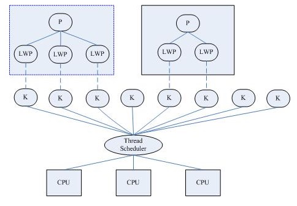
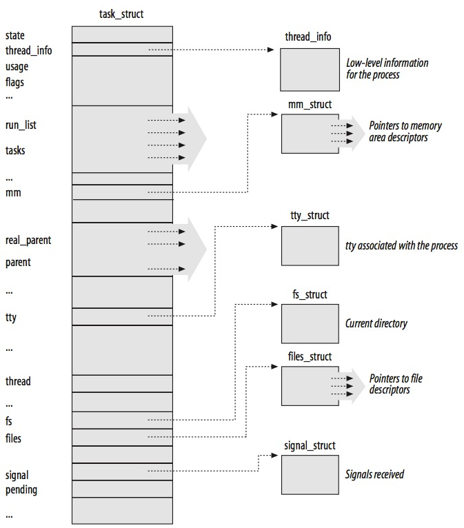
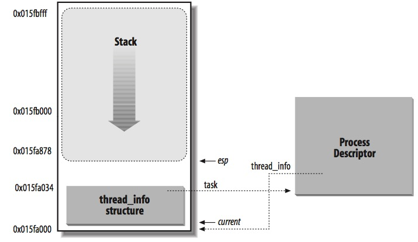
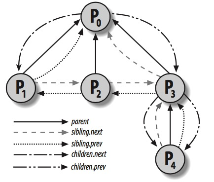
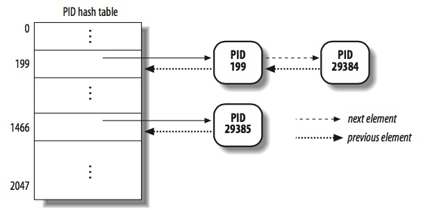

# LK Note 04
> SJTU-CS353 Linux Kernel

> Refer to the slides of Prof. Quan Chen, Dept. of CSE, SJTU.
## Lec 4. Process Management
### （1）进程和线程
* **进程**：程序运行的一个实例，是资源分配的基本单位
* **线程**：进程的一个执行流，是 CPU 调度、程序执行的基本单位
* 为什么使用线程？
    * 需要并行、单线程资源利用率低、多进程上下文切换开销大
    * 缺陷：需要同步

* **内核线程（Kernel Thread）**
    * 处理器调度基本单位
    * 内核的一个分身（clone），每个内核线程提供一个特定的功能（异步 IO）
    * 内核线程仅在内核态运行，使用的线性地址大于 `PAGE_OFFSET`
    * 低开销：仅需要内核栈、寄存器用于上下文切换
    * 创建内核线程：`kernel_thread()`

* **轻量级进程（Lightweight Process, LWP）**
    * 建立在内核之上，由内核支持的用户级线程，是内核线程的高度抽象
    * 每个进程可拥有多个 LWP，而每个 LWP 与一个内核线程相关联
    * LWP 之间共享资源（虚拟地址空间、打开的文件、信号处理方式等）
    * 限制：需要频繁的系统调用（内核线程的创建和销毁，依赖系统调用）

* **识别进程**
    * 进程描述符指针（ `struct task_struct*` ）：32-bit
    * PID：16-bit
        * 每一个进程 / LWP 与一个 PID 关联
        * 线程组（Thread Group）
            * 希望同一组的线程具有相同的 PID，引入线程组的概念
            * LWP 集合，PID 为线程组内第一个 LWP 的 PID
            * 进程描述符中的 `tgid` 字段，使用 `getpid()` 系统调用
### （2）进程描述符（Process Descriptor）
* **`struct task_struct`**
    * `state`：进程状态
    * `thread_info`：进程底层信息
    * `run_list`：进程按状态组织成链表便于调度
    * `mm`：内存管理（指向内存区描述符的指针）
    * `parent`：进程派生关系
    * `fs`：当前目录
    * `files`：文件描述符指针
    * `signal`：接收到的信号
    * ... ...

* **进程状态**
    * `TASK_RUNNING`：可以运行（运行态 + 就绪态）
    * `TASK_INTERRUPTABLE`：挂起态（睡眠态），当前不能运行，等待被信号唤醒
    * `TASK_UNINTERRUPTABLE`：同上，但是不能被信号唤醒
    * `TASK_STOPPED`
    * `TASK_TRACED`：调试态
    * `EXIT_ZOMBIE`：游离态
    * `EXIT_DEAD`

* **进程描述符管理**
    * 包含两个数据结构，占 8 KB，即两个内存页
    * `thread_info` 结构体 + 内核态的进程堆栈
    * 根据 esp 寄存器，获取 `thread_info` 结构体的地址
    * 当前正在 CPU 上运行进程的 `task_struct` 指针：`current` 宏

* **进程链表（Process List）**
    * `task_struct` 结构中的 `tasks` 字段
        * 类型：`list_head`
        * 组织成双向循环链表，`prev` 和 `next` 字段分别指向前/后一个 `task_struct`
    * `TASK_RUNNING` 状态的进程链表（runqueue）：`run_list` 字段，类型是 `list_head`
    * 为加快调度，Linux 2.6 将 runqueue 切分为 140 个链表，每个优先级 1 个
    * 进程描述符中的 `array` 字段：指向 `prio_array_t` 结构的指针

* **进程间的派生关系**
    * process 0 和 process 1 由内核创建
    * 相关字段：`real_parent` （由哪个进程 fork 的）、`parent` （可变的）、`children`、`sibling`

### （3）PID
* **PID 哈希表**
    * **根据 PID 寻找对应的 `task_struct`**
        * 如果组织成数组，不是所有 PID 都有对应的进程存在，造成空间浪费
        * 顺序搜索进程链表，效率低
    * `pid_hash` 数组包含 4 个哈希表，由内核维护，对应进程描述符中相应字段
        * `PID`
        * `TGID`（thread group leader）
        * `PGID`（process group leader）
        * `SID`（session leader）
    * 使用 Chaining 来处理 PID 冲突
 
 * `task_struct` 中的 `pids` 字段
     * `nr`：PID 的值
     * `pid_chain`：指向哈希链表（Hash chain list）前后元素的指针
     * `pid_list`：指向线程组链表（Thread group list）前后元素的指针

### （4）等待队列（Wait Queue）
* 处于 `TASK_INTERRUPTABLE` 和 `TASK_UNINTERRUPTABLE` 状态的进程
* 两种睡眠状态的进程
    * Exclusive Process
    * Nonexclusive Process：总是在事件发生时被内核唤醒

* **进程切换（上下文切换）**
    * 硬件上下文切换：a far JMP
    * 软件上下文切换：一组 MOV 指令，可以更好地控制和验证加载数据的有效性
    * 切换流程：
        * 切换页全局目录（Page Global Directory）
        * 切换内核栈（Kernel Stack）
        * 切换硬件上下文（Hardware Context，即各种寄存器的值）
            * 任务状态段（Task State Segment，TSS）：x86 架构中用于存储硬件上下文的特定段类型
### （5）进程的创建和销毁
* 进程创建
    * 实质上是对父进程的拷贝，在传统 UNIX 中直接将父进程资源拷贝一份，非常慢且低效
    * Linux 解决方案：
        * **copy-on-write（写时拷贝）**：子进程创建时与父进程共享同一物理页（标记为仅可读），当父进程或子进程任一方试图改写物理页，会产生缺页异常（page fault），内核将这个页复制到一个新的物理页并标记为可写。此时，原来的页面仍然是写保护的，如果有进程再次访问该页，内核检查该进程是否为该页的唯一属主，如果是则改为可写
        * **LWP** ：允许父子进程共享 per-process（每进程）内核数据结构（页表、打开的文件、信号处理方式等）
        * **`vfork()` 系统调用**：创建子进程时，会阻塞父进程，直到子进程退出或 `execve` 一个新进程，父进程才恢复。子进程访问的是父进程的内存地址空间，父进程不会访问

* `clone()`、`fork()`、`vfork()` 系统调用
    * `clone()`：创建 LWP，`fork()` 和 `vfork()` 使用不同的参数基于 `clone()` 的实现
    * 调用 `do_fork()` 函数

* 进程销毁
    * `_exit()`：由 `do_exit()` 函数处理
    * `exit_group()`：由 `do_group_exit()` 函数处理
    * 使用 `release_task()` 释放僵尸进程的进程描述符
