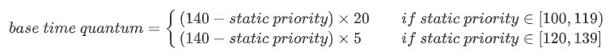
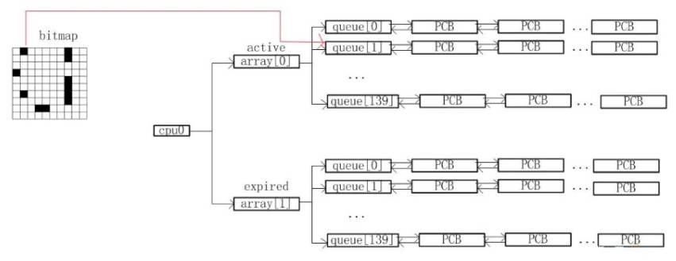
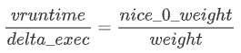
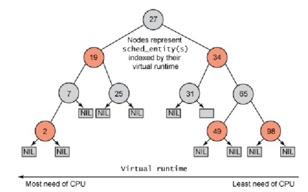

# LK Note 05
> SJTU-CS353 Linux Kernel

> Refer to the slides of Prof. Quan Chen, Dept. of CSE, SJTU.
## Lec 5. Process Management: Scheduling
### （1）调度策略
* 基于分时技术（time-sharing），即时间分片，时分复用
* 基于优先级排序；如果某进程的 CPU 使用频率较低，可以适当提高其优先级（动态优先级），防止进程饥饿
* 进程可分为：实时进程、交互式进程、批处理进程（按优先级从高到低）
* 时间片长度，太短则进程切换开销过大（上下文保存/恢复），太长则进程看起来并不是并发运行；寻求折中，在保证低响应时间的前提下，尽量选择较长的时间片
* Linux 用户进程可抢占：
    * 当前进程的时间片用完
    * 新进程比当前进程具有更高的优先级
* 被抢占进程仍然处于 `TASK_RUNNING` 状态（`TASK_RUNNING` 表示可运行，但这里实际并未运行，处于就绪态），并未进入挂起态
### （2）调度算法
* 3 种调度类别：
    * `SCHED_FIFO`：先进先出（实时）
    * `SCHED_RR`：Round-Robin（时间片轮转）（实时）
    * `SCHED_NORMAL`：传统的时分共享进程（交互式 & 批处理）
    
* 静态优先级（static priority）：100-139（值越小，优先级越高，时间片越长）
  
    * 可由 `nice()`，`setpriority()` 系统调用改变
    
* 基本时间片（base time quantum）：一个进程消耗完先前的时间片后，调度器分配给该进程的时间片量；以下公式单位为 milliseconds

* 动态优先级 = 静态优先级 - bonus + 5，但需要保证介于 [100,139] 之间，与 100 取 max，与 139 取 min
    * bonus：0-10，＜5 降低优先级（值增大），＞5 提升优先级（值减小）
    * bonus 由进程平均睡眠时间（average sleep time）决定；平均睡眠时间越小，进程切换太频繁，适当降低优先级，即 bonus 较小（＜ 5）；平均睡眠时间越大，进程容易发生饥饿，适当提高优先级，即 bonus 较大（> 5）
* 活动进程、过期进程：
    * 活动进程：未耗尽时间片的可运行进程
    * 过期进程：已耗尽时间片的可运行进程
    * 各进程周期性地在活动进程和过期进程之间转变
    * 静态优先级用于时间片分配，动态优先级用于调度
* 实时进程的调度：
    * 优先级：1-99
    * 总是处于活动状态
    * 一个实时进程在如下情况被切换：
        * 另一个进程有一个更高的实时优先级
        * 因阻塞操作进入睡眠（等待某种事件）
        * stopped or killed
        * 通过 `sched_yield()` 系统调用主动释放 CPU 所有权
        * 采用 `SCHED_RR`（Round-Robin Real Time） 调度，且时间片耗尽时
### （3）实现支持
* 多级反馈队列算法（Multi-level Feedback Queue）
    1. 如果进程 A 的优先级 ＞ 进程 B 的优先级，那么调度器选择进程 A
    2. 如果进程 A 的优先级 = 进程 B 的优先级，那么它们同属一个队列里，使用 Round-Robin 调度算法来选择（时间片轮转，保证公平）
    3. 当一个新进程进入调度器时，把它放入到最高优先级的队列里
    4. 当一个进程吃满了时间片，那么需要把优先级降一级，从高优先级队列中迁移到低一级的队列里；当一个进程在时间片还没有结束之前放弃 CPU ，那么优先级保持不变，维持原来的高优先级
* `runqueue` 数据结构，两组可运行进程：
    * `active`：指向活动进程列表
    * `expired`：指向过期进程列表
    * `arrays`：两组进程（`arrays[0]`，`arrays[1]` 表示活动/过期进程）
    * 所有进程从 `active` 变成 `expired` 之后，可以改变指针指向，`active->arrays[0]` 变为 `active->arrays[1]`

### （4）完全公平调度器（CFS）
* 虚拟运行时间 `vruntime`
	* `vruntime` 表示进程虚拟的运行时间，每个任务具有相同的 `vruntime`
	* `nice_0_weight` 表示 `nice=0` 的权重值
	* 该进程权重值越大，实际运行时间越长，保证公平调度

* CFS 调度器的实现
    * 选择红黑树记录任务的运行时间（红黑树：平衡二叉搜索树，大多操作复杂度 `O(logn）`
    * 选择红黑树最左边节点（最少时间）的进程运行
    * 选择的进程从树中移除，更新执行时间，重新插入红黑树中

* 进程调度时机
    * 阻塞操作：互斥量（mutex）、信号量（semaphore）、等待队列（wait queue）
    * 在中断返回前和系统调用返回用户空间时，检查 `TIF_NEED_RESCHED` 标志位以判断是否需要调度
    * 将要被唤醒的进程（Wakeups）
* 进程切换 `switch_to()`
    * 调度器的职责选择下一个进程运行，而进程切换负责具体落实该进程的执行
    * 切换的本质：
        * 保存上一个进程的上下文
		* 装载下一个进程的上下文到 CPU