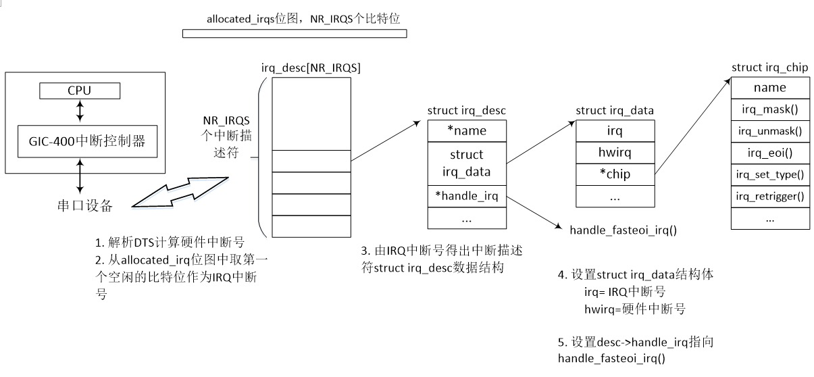
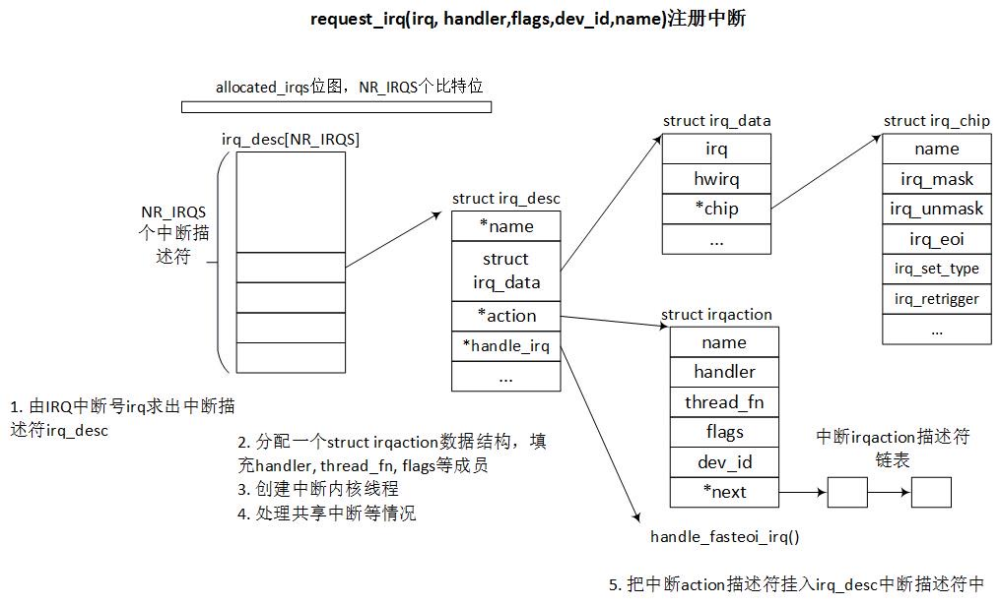

# LK Note 06
> SJTU-CS353 Linux Kernel

> Refer to the slides of Prof. Quan Chen, Dept. of CSE, SJTU.
## Lec 6. Interrupt Handling
### （1）中断和异常
* 轮询和中断
    * 轮询（Pooling）：CPU 主动查询设备状态，从而进行必要的 I/O
        * 优点：简单、易实现、易控制
        * 缺点：系统开销大，无法感知设备状态变化、浪费 CPU 资源
    * 中断（Interrupt）：CPU 被动响应中断信号（设备在发生状态改变时，比如读操作结束），被定义为一个事件，该事件改变 CPU 指令执行顺序
        * 优点：难实现、可能遗漏信息
        * 缺点：I/O 吞吐量大时，效率比轮询低
* 中断的分类
    * 同步中断（异常、内中断）：由 CPU 控制单元在执行指令时产生
        * 陷阱（Trap）：有意而为之的系统调用，用户程序请求内核服务
        * 故障（Fault）：可能可以解决的错误，解决后重新开始，如缺页异常（page fault）
        * 终止（Abort）：无法解决的致命错误，导致程序终止
    * 异步中断（中断、外中断）：由其它硬件设备产生，产生的时刻与 CPU 时钟信号无关，所以称为异步
        * 可屏蔽中断
        * 不可屏蔽中断：CPU 必须响应
* 中断处理流程：① 外设发中断；② CPU 响应和处理中断；③ 中断返回
* 中断随时到来，应尽可能快地处理完中断，尽可能把更多处理推迟
* 中断处理程序必须支持嵌套中断，高优先级中断可以中断低优先级中断，维持更多 I/O 设备处于忙状态
* 被中断的函数必须是可重入的（Reentrant）
> **可重入函数（Reentrant Function）**：主要用于多任务环境下，重入即可以重复进入，意味着这个函数可以被中断，在这个函数执行的任何时刻中断它，内核切换执行另一段代码，返回控制不会发生错误。因为它只使用了自己栈上的变量，不依赖于系统外部环境（全局和静态变量区、中断向量表等），所以允许多个函数的副本并发运行，因为它们使用的是独立的栈，不会互相干扰。如果确实需要访问全局变量，同时保证函数的可重入性，则需要实施互斥手段（关中断、信号量等操作）
* 临界区中必须禁止中断，临界区可能改变全局变量而不可重入
* 中断处理函数
    * 不可被阻塞
    * 分为：上半部、下半部
        * 上半部：必须立即执行的代码（可很快执行），响应硬件（比如向硬件确认已收到中断号）
        * 下半部：可以延迟执行的工作
    * 不能直接与用户空间进行数据交换
    * 不需要可重入？
    * 不可休眠
### （2）中断处理
* 中断描述符表（Interrupt Descriptor Table, IDT）
    * 每一种中断对应一个中断号，x86 最多支持 256 种中断
    * 中断是 CPU 的机制，只要运行 x86 架构，IDT必然存在
    * IDT 存放各中断对应的中断处理程序（由操作系统提供）
    * IDT 是一个最大为 256 项的表，每个表项占 8 字节，称为中断门
        >任务门（Task Gate）：当中断信号发生时，必须取代当前进程的那个进程的 TSS 选择符存放在任务门中
        
        > 中断门（Interrupt Gate）：包含段选择符和中断处理程序的段内偏移量
        
        > 陷阱门（Trap Gate）：大部分 Linux 异常处理程序都通过陷阱门激活
    * 设中断号为 n ，则中断门地址为 IDT.base + n * 8
* 中断上下文保存
    * 保存中断现场（如 `lr_irq` 寄存器、`spsr_irq` 寄存器）
    * 跳转到中断处理函数（在 IDT 中查找）
    * 恢复中断线程，返回到被中断点继续运行

### （3）Linux 中断处理过程
* 硬件中断号 v.s. 软件中断号
    * 硬件中断号：硬件 Soc 设计时就确定下来的中断号
    * 软件中断号（Linux 中断号、IRQ 中断号）：Linux 系统映射的中断号，可用于注册中断函数（即 `... request_irq(unsigned int irq, ...` 中的 `irq`）
    * `cat /proc/interrupt` 查看中断分配情况（包括软件中断号对应的硬件中断号）
    * 两个相同设备具有相同的硬件中断号，但在 Linux 系统中需要映射为两个不同的软件中断号方便区别二者
* 分配软件中断号（IRQ 中断号）
    * 宏 `NR_IRQS` 定义了硬件平台支持的中断数量最大值
    * 位图变量 `allocated_irqs` 用来分配软件中断号
    * 中断映射过程在 `irq_domain_alloc_irqs()` 函数中，从 `allocated_irqs` 位图里分配一个空间的比特位作为软件中断号，并分配一个 `struct irq_desc` 数据结构，即中断描述符
    * `struct irq_desc[NR_IRQS]` 是中断描述符数组，数组下标即 IRQ 中断号，对应一个 `struct irq_desc`

* 注册中断 API ： `request_irq(irq, handler, flags, dev_id, name)`
    * 每个请求的中断都有一个 `irqaction` 描述符，用于封装中断处理函数，由驱动人员负责分配，包含中断号、中断处理函数指针、中断标志位、中断名等
    * 对于共享中断，多个 `irqaction` 描述符串成一个链表

### （4）中断的上半部和下半部

* 中断上半部：中断处理程序
    * 完成尽可能少的紧急硬件操作
    * 关中断（不允许被其它中断打断）
    * 内核立即运行
* 中断下半部：延迟处理程序
    * 完成延缓的耗时操作（中断大部分任务）
    * 可以开中断，允许中断请求
    * 稍后完成
* 为什么要有中断上半部？
    * 硬件中断处理程序以异步方式执行，通常需要关中断，会打断其它重要代码的执行
    * 为避免被打断程序停止太长，中断处理应尽快完成，所以将可以尽快完成的紧急操作作为中断上半部由内核立即执行，然后返回到被中断的程序
* 任务放置原则：以下任务应放在上半部
    * 对时间敏感
    * 和硬件相关
    * 需要保证不被其它中断所打断
* 中断线程化
    * 下半部由一个内核线程完成，接受处理器调度，优先级高于普通进程
    * 可以减小高优先级进程延迟，提高响应性
* SMP IRQ Affinity：把中断均衡分布在不同的 core 上
* 中断下半部执行时机
    * 上半部完成后即执行
    * 下半部执行的部分放在一个内核线程中，中断返回之后调度这个内核线程来执行（中断线程化）
### （5）软中断、Tasklet、工作队列 Workqueue
* 进程上下文
    * 用户进程执行系统调用触发异常时，传递给内核的参数、内核要保存的一整套变量和寄存器值、当时的环境等
* 中断上下文
    * 中断发生时，硬件传递给内核的参数和内核需要保存的环境（被中断进程的环境）
    * 包括：硬中断上下文、软中断上下文
* 软中断
    * 执行点：中断处理函数完成之后，返回中断之前
    * 类型是静态定义的
    * 回调函数是在开中断下执行的（不能被自己打断，单个 CPU 软中断不可嵌套），只能被上半部打断
    * 同一类型的软中断，可以在多 CPU 上并行执行，可重入
* Tasklet
    * 基于软中断实现的一种下半部机制，软中断的变种
    * 一种特定类型的 Tasklet 只运行在一个 CPU 上，不能并行，只能串行执行
    * 多种不同类型的 Tasklet 可以并行运行在多个 CPU 上
    * Tasklet 可以在运行时改变
    * 每个 CPU 维护两个 Tasklet 链表（每 CPU 变量），一个用于普通优先级，一个用于高优先级
* 工作队列（Workqueue）
    * 把中断下半部放到进程上下文来执行，交由一个内核线程来执行
    * 延迟执行任务：工作（work），数据结构 `work_struct`
    * 工作以队列结构组织成工作队列，数据结构 `workqueue_struct`
    * 工作线程负责执行工作队列里的工作
    * 可解决软中断和 Tasklet 执行时间过长，导致实时性下降的问题
    * 为解决内核线程数量多、并发性差、可能死锁等问题，引入 CMWQ（并发管理工作队列），设置 Bound 类型（指定分配到哪个 CPU）和 Unbound 类型（不指定分配到哪个 CPU）的工作线程池（含高低优先级两个池）
* 如果延迟执行的任务...
    * 需要睡眠，只能选择工作队列
    * 需要延迟指定的时间再触发，使用工作队列（利用内核定时器）
    * 需要在短时间内处理，使用软中断/Tasklet，因为其可以抢占普通进程和内核线程，同时不可睡眠，时效性更好
    * 对延迟时间没有要求，使用工作队列（通常为无关紧要的任务）

