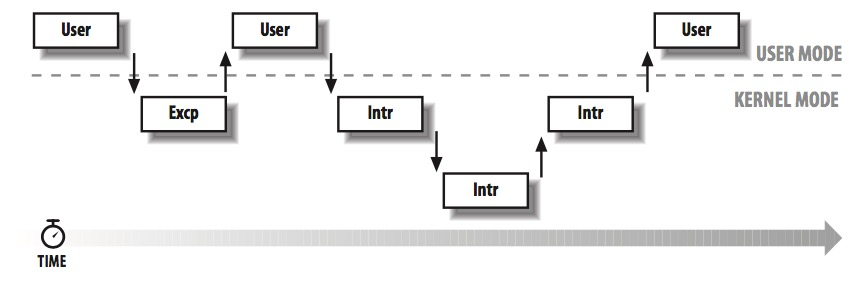
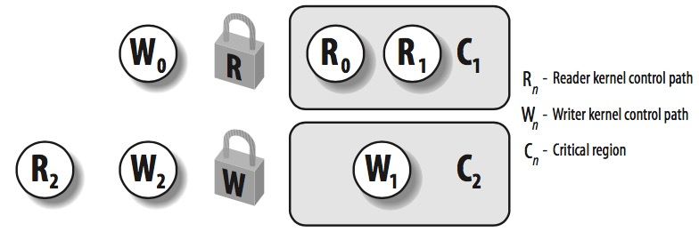

# LK Note 07
> SJTU-CS353 Linux Kernel

> Refer to the slides of Prof. Quan Chen, Dept. of CSE, SJTU.
## Lec 7. Kernel Synchronization
### （1）内核控制路径（Kernel Control Paths）
* **内核控制路径**：当前进程在**内核态**执行的一个指令序列（中断/异常）

* **内核抢占**
    * 可抢占内核：一个运行在内核态的进程，在执行内核函数时，可以被另一个进程所抢占
    * 主要目的：减少用户态进程的分派延迟（进程从可运行态到真正运行的延迟）
    * 内核只有在执行异常处理函数（系统调用）时才可能被抢占

### （2）同步场景
* 竞争条件发生场景：计算的输出结果取决于两个及以上交错运行的内核控制路径的嵌套情况
    * 示例：test 和 set 不能一气呵成，线程发生调度，导致同时进入临界区，计算结果有误
* 线程之间必须互斥访问临界区
    * 在**单核计算机**上，可以**禁止中断**来实现临界区
    * 若数据仅在系统调用的服务函数间共享，可以**禁止内核抢占**来实现临界区
    * 多核系统的同步更为复杂
* 简化同步的内核设计
    * 中断处理程序完成之前不允许产生同类中断事件
    * 中断处理程序、软中断不可以被抢占和阻塞
        * 中断处理程序不必同步
    * 执行中断处理的内核控制路径，不能被执行可延迟函数/系统调用的内核控制路径中断
        * 仅被软中断访问的每 CPU 变量不需要同步
    * 软中断不能在一个 CPU 上交错执行

### （3）同步原语（Synchronization Primitives）

| 技术                                      | 描述                            | 适用范围 |
| ----------------------------------------- | ------------------------------- | -------- |
| **per-CPU 变量**（per-CPU variable）       | 每个 CPU 存有一个数据结构的副本 | All      |
| **原子操作**（Atomic operation）          | 原子 read-modify-write 指令     | All      |
| **内存屏障**（Memory barrier）            | 避免指令重排序                  | Local    |
| **自旋锁**（Spin lock）                   | 使用忙等的锁                    | All      |
| **信号量**（Semaphore）                   | 使用阻塞等的锁                  | All      |
| **顺序锁**（Seq lock）                        | 基于访问计数器的锁              | All      |
| **禁止本地中断**（Local interrupt disabling） | 单 CPU 上禁止中断               | Local    |
| **禁止本地软中断**（Local softirq disabling） | 单 CPU 上禁止可延迟函数         | Local    |
| **读-拷贝-更新**（Read-copy-update，RCU）       | 通过指针无锁访问共享数据        | All      |

* **per-CPU 变量**
    * 一个内核变量对应一个数组，每个 CPU 使用其中一个变量副本；一个 CPU 不应访问数组中对应于其它 CPU 的变量副本。在多 CPU 系统中，当 CPU 操作属于它的副本时，不需要考虑与其它 CPU 的竞争问题，还可以充分利用 CPU 本地的硬件缓存来提高访问速度
        * 静态 per-CPU 变量：存储空间在代码编译时静态分配
        * 动态 per-CPU 变量：存储空间在代码运行时动态分配
    * per-CPU 变量在于保护多个 CPU 对一个变量的同步访问，但不保护异步函数（中断处理函数、可延迟函数）对变量的同步访问
    * 内核抢占，可能使 per-CPU 变量产生竞争条件
        * 一个 CPU 上的两条路径首先拿到了同一副本的指针，此时发生内核抢占，其中一条路径调度到另一个 CPU 上，然而此时两条路径仍然访问同一副本

* **原子操作**
    * 80x86 原子指令：进行 0 次或者 1 次对齐内存访问的指令
        * `read-modify-write` 指令
    * `atomic_t` 类型：24-bit 原子访问计数器

* **内存屏障**：内存屏障原语前面的指令完成后，才会执行原语后面的指令，避免了指令重排序，保障了同步

* **自旋锁**
    * 适用于多处理器环境
    * `spinlock_t` 类型
    * 进程检查锁是无序的，不用排队
    * **读写自旋锁**
        * 增加内核的并发度：多个 read，单个 write（允许多个 read 的路径进入临界区）
        * `rwlock_t` 类型
        * `read_lock()`，`read_unlock()`，`write_lock()`，`write_unlock()`

* **顺序锁**：类似 read/write 自旋锁，给 write 锁更高的优先级，即使临界区加了 read 锁，一个进程仍然可以对其加 write 锁（将其中的 read 路径强制移出临界区，可能需要多次 read 才能得到有效副本）

* **读-拷贝-更新（RCU）**
    * 针对 “读多写少” 的共享数据的同步机制
    * 随意读，但更新数据的时候，需要先复制一份副本，在副本上完成修改，再一次性地替换旧数据
    * 它允许多个读者同时访问共享数据，而且读者的性能不会受影响（ “随意读” ），读者与写者之间也不需要同步机制（但需要 “复制后再写” ），但如果存在多个写者时，在写者把更新后的 “副本” 覆盖到原数据时，写者与写者之间需要利用其他同步机制保证同步。
    * 特点：
        * 保护由多个 CPU 读取访问的数据结构，允许多个进程对数据并发读写，通过指针无锁访问数据
        * 只有通过指针动态分配和利用的数据结构，才可以使用 RCU 保护
        * RCU 保护的临界区不可以有内核控制路径进入睡眠状态

* **信号量**
    * 不会自旋忙等，而是挂到信号量的等待队列上
    * 两种信号量：
        * 内核信号量：内核控制路径使用
        * System V IPC 信号量：用户进程使用
    * 内核信号量 `semaphore`
        * `down()`：获取信号量锁（wait，P，- -）
        * `up()`：释放信号量锁（signal，V，++）
    * 读写信号量 `rw_semaphore`
        * `init_rwsem()`：初始化读/写信号量
        * `down_read()，down_write()`：获取读/写信号量
        * `up_read()，up_write()`：释放读/写信号量

### （4）内核数据结构的同步访问
* 指导原则：系统支持的并发度越高越好
* 提升目标：
    * 提升并发运转的 I/O 设备数量
    * 提升有效工作的 CPU 数量
    * `int` 型的共享数据结构可以声明为 `atomic_t` 类型，使用原子操作进行更新
