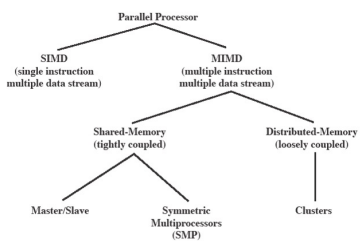
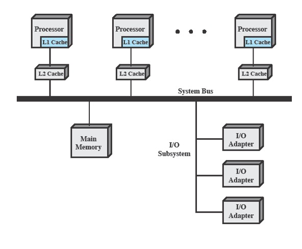
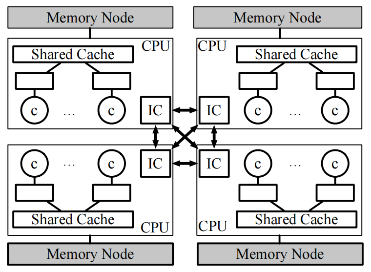
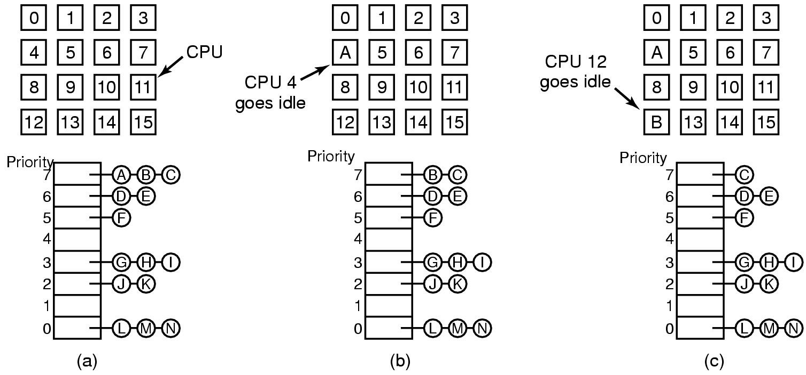
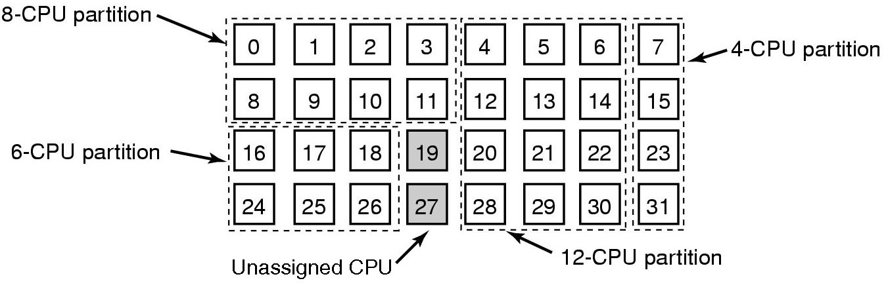
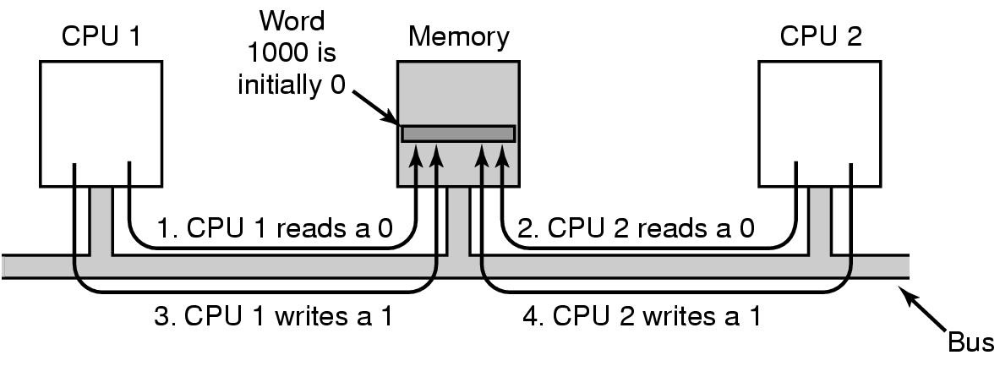
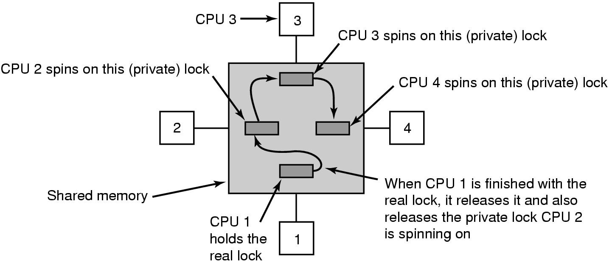
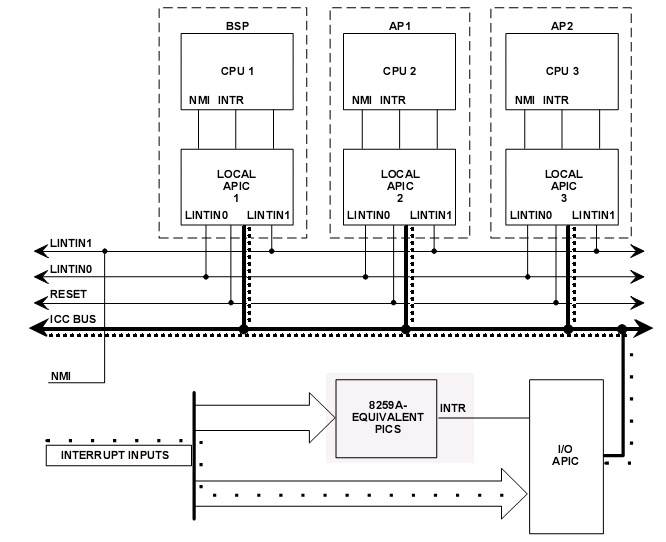

# LK Note 08
> SJTU-CS353 Linux Kernel

> Refer to the slides of Prof. Quan Chen, Dept. of CSE, SJTU.
## Lec 8. Symmetric Multiprocessing
### （1）SMP 简介
* 并行体系结构

<p align="center"></p>

* **SMP（Symmetric Multiprocessing，对称多处理）**
    * 多个对称的处理器连接到一个共享内存（紧耦合）
    * 所有处理器对所有 I/O 设备具有完全控制权限
    * 由同一个操作系统控制，系统平等对待所有处理器
    * 当前多处理器系统大多使用 SMP 架构。多核处理器的核也可以视为不同处理器，从而构成 SMP 架构

<p align="center"></p>

* **NUMA（Non-uniform Memory Access，非一致内存访问）**
    * 一种多处理器系统使用的内存设计
    * 处理器访问内存的延迟，取决于内存相对于处理器的位置：
        * 访问本地内存数据，比访问非本地内存数据更快
        * 非本地内存：连接在其它处理器上的内存节点
    * NUMA 优势在于存取具有本地化特征的数据

<p align="center"></p>

* SMP 的特征
    * 允许 Linux 内核不同部分在不同处理器上并发运行
    * 每个处理器从可运行进程/线程中自主进行调度，以获取所执行的进程/线程

* 多处理器操作系统设计
    * 进程/线程的并发 -> 可重入
    * 调度 -> 避免冲突，线程分布到不同处理器，负载均衡
    * 同步 -> 对共享数据的并发访问
    * 内存管理 -> 多端口内存、分页机制一致性等
    * 可靠性与容错 -> 处理器失效

### （2）SMP 进程调度
* **时分共享**

<p align="center"></p>

* **空分共享**

<p align="center"></p>

### （3）SMP 同步问题
* 同步难题 —— TSL 指令（Test and Set Lock）
    * 在 SMP 系统中，如果仅对内存区域加锁，不同处理器的 TSL 指令会出现同时对一块内存区域加锁的情况
    * 考虑对总线加锁，一个处理器对总线加锁后，另一个处理器执行 TSL 指令失败（无法读总线）

<p align="center"></p>

* 同步难题 —— 缓存颠簸（Cache Thrashing）
    * 使用多个锁避免缓存颠簸

<p align="center"></p>

### （4）SMP 源码分析
#### 【1】SMP：Linux 启动过程
* 基本概念
    * ***BSP***（Bootstrap Processor，启动 CPU）：在操作系统启动过程前期，只有 BSP 在执行指令（随机选取的一个处理器）
    * ***AP***（Application Processor，应用 CPU）
    * ***APIC***（Advanced Programmable Interrupt Controller，高级可编程中断控制器）：分为 Local APIC 和 I/O APIC
    * ***IPI***（Inter-Processor Interrupt，处理器间中断）：用于处理器之间的通信

* 由于 BIOS 代码不支持多线程，所以 SMP 中必须让所有 AP 进入中断屏蔽状态，不与 BSP 一起执行 BIOS 代码。BIOS 程序将其它 AP 置于中断屏蔽状态，只选择 BSP 执行 BIOS代码中的后继部分

* 主要流程
    * BIOS 初始化（屏蔽 AP，建立系统配置表格）
    * MBR 里面的引导程序（Grub，Lilo 等）将内核加载到内存
    * 执行 `head.S` 中的 `startup_32` 函数（最后将调用 `start_kernel`）
    * 执行 `start_kernel`（相当于 main 程序），进行一系列初始化，最后将执行：
        * `smp_init()`：启动各个 AP
            * `smp_boot_cpus()`：初始化各 AP，设置为待命模式，等待 BSP 发送 IPI 指令，并为之建立 0 号进程
        * `rest_init()`：调用 `init()` 创建 1 号进程，自身执行 `cpu_idle()` 成为 0 号进程
    * 1 号进程（init 进程）完成余下的工作

* 注意：在 SMP 中，有几个 CPU，就有几个 0 号进程（idle 进程），而 1 号进程（init 进程）只有一个

* **【总结】BSP 负责操作系统的启动，在启动的最后阶段，BSP 通过 IPI 激活各个 AP，在系统的正常运行过程中，BSP 和 AP 基本上无差别**

#### 【2】SMP：Linux 进程调度

* 多处理器间调度时，切换的下一个处理器最好是上一个处理器（由局部性原理，上次使用的处理器的 Cache 中仍保存较多程序使用到的数据，hot cache）
```c
struct task_struct {
    // ...
    int processor;      // 正在使用的 CPU
    int last_processor; // 上次使用的 CPU
    // ...
};
```

* SMP 进程调度主要函数和宏
    * `schedule()`：进程调度主函数
        * `switch_to()`：上下文切换
    * `reschedule_idle()`：在 SMP 系统中，如果被切换下来的进程仍然是可运行的（TASK_RUNNING），调用该函数重新调度，以选择一个空闲的或者运行低优先级进程的 CPU 来运行这个进程
    * `goodness()`：优先级计算函数，选择一个最合适的进程投入运行
    
* **【总结】与单处理器系统主要差别是，执行进程切换后，被换下的进程可能换到其它 CPU 上继续运行。在计算优先权时，对进程上次运行的 CPU 适当提高其优先权，从而更有效地利用 Cache**

#### 【3】SMP：Linux 中断系统

<p align="center"></p>

* **【总结】为支持 SMP，在硬件上需要 APIC，Linux 定义了各种 IPI 的中断向量以及传送 IPI 的函数**