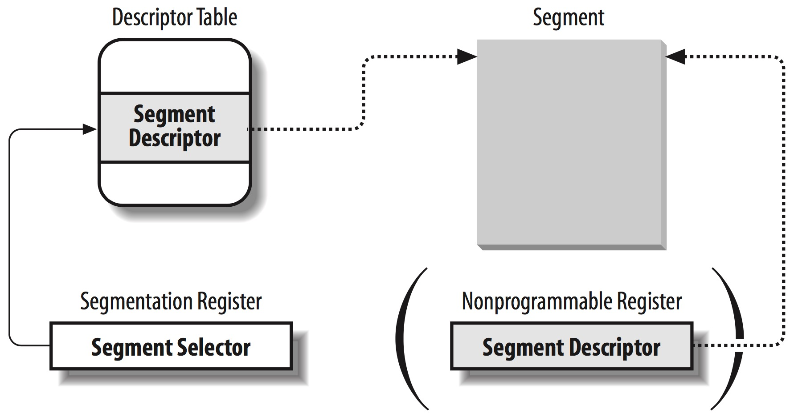

# LK Note 09
> SJTU-CS353 Linux Kernel

> Refer to the slides of Prof. Quan Chen, Dept. of CSE, SJTU.
## Lec 9. Memory Management: Addressing
### （1）内存地址
* 内存地址分类
    * **逻辑地址**（logical address）：机器语言指令中使用
    * **虚拟地址**（virtual address）：又称线性地址（linear address）
    * **物理地址**（physical address）：在内存芯片中寻址内存单元
* **分段**：逻辑地址 -> 虚拟地址
    * 给每个进程分配不同的线性地址空间
* **分页**：虚拟地址 -> 物理地址
    * 基于页表机制，把线性地址空间映射到不同的物理空间
### （2）段式寻址
* **逻辑地址 = { 段选择符，偏移量 }**
    * **段选择符（segment selector）：16-bit**
        * index：段描述符的 index
        * TI：指明 index 是 GDT（全局描述符表）还是 LDT（局部描述符表）
        * RPL：特权等级
        * **段寄存器：用于存储段选择符**
            * cs：代码段；ss：堆栈段；ds：数据段；es/fs/gs：通用
    * 偏移量：32-bit

* **段描述符（segment descriptor）：8-byte**
    * 存放在 GDT 或 LDT 中
        * GDT 和 LDT 在内存中存放的起始地址和大小 -> 控制寄存器 gdtr，ldtr
    * 字段：
        * Base：32-bit 的线性地址
        * Limit：20-bit 的偏移量
        * ... ...
    * 段描述符快速访问：80x86 的 6 个可编程段寄存器 -> 不可编程的寄存器作为段描述符缓存：每次加载段选择符时，把相应的段描述符（8 bytes）由内存的 GDT/LDT 加载到不可编程的寄存器中

* **逻辑地址 -> 线性地址**

* **Linux 段式寻址**
    * Linux 倾向于分页，仅在必要时分段
    * 4 个主要的段：内核代码段、内核数据段、用户代码段、用户数据段
    * Linux GDT：每个 CPU 一个 GDT，包含 18 个段描述符
        * 4 个 内核/用户 代码/数据 段
        * 任务状态段（TSS，task state segment）
        * ... ...
### （3）页式寻址
* **页（page）**：固定大小的线性地址区间（Linux 4KB）
* **页框（page frame**）：物理内存被切分成相同大小的内存页/物理页
* 在 80x86 微处理器中，设置控制寄存器 cr0 的 PG 标志，启用分页机制
* **规则分页**
    * 4 KB 的页，对应页内地址/偏移量 12-bit
    * 线性地址：32-bit <-> 可寻址 4GB 虚拟内存空间
        * 页目录（Directory）：10-bit
        * 页表（Table）：10-bit
        * 偏移量（Offset）：12-bit
    * 二级转换机制
        * 页目录表的起始物理地址 -> cr3 寄存器
        * 设计思想
            * 32 位线性地址 -> 4 B 页目录项/页表项（页目录、页表都在内存中）
            * 页目录表/页表均为 10 位，共 1024 项，每项 4 B，总共 4 KB，刚好一个页的大小
    * 每个进程都有独立的分页转换
        * 进程之间的虚拟地址空间相互独立
        * 两个进程不同的虚拟页，通过页表映射至相同的物理页框，可实现共享内存
        * 若进程发生缺页时，可能换出自己或其它进程的物理页到磁盘上，这时需要在页表中记录每个进程的页是否在内存中
    * 页目录项/页表项结构
        * 下列提到的页：页目录项指向页表所在的页/页表指向的页
        * 20-MSB：页框物理地址的高 20 位，与虚拟地址的 12-LSB（偏移量）拼接在一起，组成物理地址
        * present：页是否在内存中（涉及内存页的换入换出）
        * accessed：页最近访问时间，访问几次？（页面置换算法考虑）
        * dirty：（仅页表项）页调入内存后是否被修改
        * 分页的硬件保护
            * read/write：页的存取访问权限
            * user/supervisor：特权等级
        * ... ...

* **扩展分页**
    * 32-bit = { 页目录 10-bit，偏移量 22-bit }
    * 页的大小：4 MB
    
* **物理地址扩展（PAE）**
    * 36 位地址 = { 24，12 }，设置 cr4 控制寄存器的 PAE 标志位来启动该机制
    * 每个页表项 8 B，一个页表中有 4 KB / 8 B = 512 个表项，对应 9 位
    * 每个进程仍然只能看到 4 GB 的内存（机器仍为 32 bit）
    * 4 KB 页：{ 2，9，9，12 }
        * PDPT（page directory pointer table，页目录指针表）：cr3 指向起始地址
        * 页目录表
        * 页表
        * 偏移量

* **TLB**：快表，硬件缓存，存储近期访问过的页

* **Linux 页式寻址**
    * 5 级分页机制
        1. 页全局目录（Page Global Directory，**PGD**）
        2. *页四级目录（Page 4th Directory，**P4D**）*
        3. 页上级目录（Page Upper Directory，**PUD**）
        4. 页中级目录（Page Middle Directory，**PMD**）
        5. 页表（Page Table Entry，**PTE**）
    * 页表处理相关的数据结构：`pgd_t` `pud_t` `pmd_t` `pte_t`

