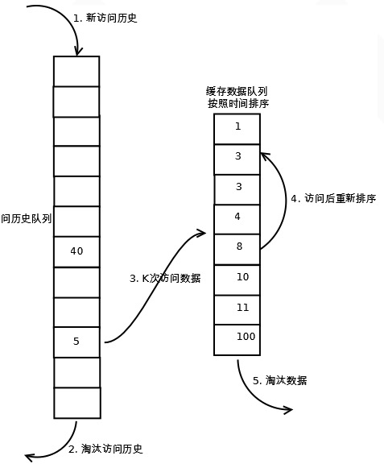

# LK Note 10
> SJTU-CS353 Linux Kernel

> Refer to the slides of Prof. Quan Chen, Dept. of CSE, SJTU.
## Lec 10. Memory Management: Methods
### （1）页框管理
* 标准页框大小：4 KB
* **页描述符 `page`**：32 B，存储在 `mem_map` 数组中
* **NUMA（非一致内存访问）**
    * Physical Memory : Node : Zone : Page
    * 物理内存被切分为多个节点（Nodes），每个节点有：
        * **节点描述符** `pg_data_t`
            * `struct zone[] node_zones;` 节点的管理区描述符数组
            * `int nr_zones;` 节点的管理区数量
    * 每个节点的物理内存进一步划分为多个管理区（Zone），每个区有：
        * **管理区描述符** `zone`
            * `unsigned long free_pages;` *Number of free pages in the zone*
            * `unsigned long pages_min;` *Number of reserved pages in the zone (Pool of Reserved Page Frames)*
            * `unsigned long pages_low/pages_high;` *Low/High watermark for page frame reclaiming; also used by zone allocator as a threshold value. (Zone Allocator)*
            * `struct free_area[] free_area;` *Blocks of free page frames in the zone (Buddy System)*
            * `struct list_head active/inactive_list;` *List of active/inactive pages in the zone*
    * 三种管理区
        * `ZONE_DMA`、`ZONE_NORMAL`、`ZONE_HIGHMEM`
* **保留页框池（Pool of Reserved Page Frames）**
    * 有些内核控制路径在请求内存时不允许被阻塞 —— 原子分配请求
    * 内核保留了部分页框，供原子内存分配请求使用 —— 保留页框池
* **分区页框分配器（Zoned Page Frame Allocator）**
    * 注：保留页框池是留给内核自己使用的，分页页框分配器不是
    * 请求页框 `alloc_pages`，释放页框 `free_pages`
    * Per-CPU 页框缓存
        * 每个 Per-CPU 页框缓存，包含了一些预先申请的页框，用以加速单个内存页的分配请求
            * Hot Cache：内容很可能存在硬件缓存（TLB）的页框
            * Cold Cache
        * `per_cpu_pages` 描述符
            * `int count;` *Number of page frames in the cache*
            * `int low;` *Low watermark for cache replenishing*
            * `int high;` *High watermark for cache depletion*
            * `int batch` *Number of page frames to be added/subtracted from the cache*
            * `struct list_head list;` *List of descriptors of page frames in the cache*
            * 如果 `count < low`，kernel 从伙伴系统中申请 `batch` 个单独的页框（4 KB）来补充对应的高速缓存
            * 如果 `count > high`，kernel 从缓存中释放 `batch` 个页框回到伙伴系统

<p align="center"></p>

* **伙伴系统**
    * 避免外碎片的方法：
        * 使用分页单元（Paging Unit）将不连续的页框映射为连续的线性地址
        * 尽量避免切分大的连续空闲内存来满足小的空间需求
    * Linux 不使用分页技术避免外碎片
        * 有时候分配连续的内存页框是有必要的
        * 保持内核页表不变的优势
        * 内核可以通过使用 4 MB 的页来访问大块连续物理内存
    * **伙伴系统（Buddy System）**
        * 11 个内存块链表，大小为 2^0^ - 2^10^ 个连续页框的内存块
        * Linux 2.6 使用 3 个伙伴系统，分别管理：DMA 页框、普通页框、高内存区页框
        * 分配一块内存：比如需要分配 13 个页框，需要用掉 2^4^=16 个页框的内存块，然后归还 2^0^=1 和 2^1^=2 的内存块各一个，挂到相应链表上
        * 释放一块内存：尽量合并成大的内存块（伙伴内存块之间合并）
            * 伙伴内存块：内存块大小一致、物理地址连续
            * 如下图中的 P0 和 P1 为伙伴内存块，如果 P1、C1、B1 空闲，释放 P0 ，即可逐级合并直到释放 A0

<p align="center"></p>

* **伙伴系统（续）**
    * 伙伴系统的数据结构
        * 管理区描述符 `zone` 中的 `struct free_area free_area[11];` 字段
        * `free_area[k]` 管理所有大小为 2^k^ 个页框的空闲内存块
        * `free_area[k]->free_list` 字段，是一个双向循环链表的头指针，管理所有大小为 2^k^ 个页框的空闲内存块的页描述符
    * 仍然存在外碎片化

<p align="center"></p>

* **伙伴系统（续）**
    * 碎片化解决方案：迁移类型
        * 迁移类型按照页块（PageBlock）划分，一个页块正好是页面分配器最大的分配大小，即 2^10^=1 K 个页框，即 4 MB
        * 三种类型：
            * 不可移动类型（UNMOVABLE）：在内存中有固定位置，不能移动到其它地方
            * 可移动类型（MOVABLE）：可以随意移动的页面
            * 可回收类型（RECLAIMABLE）：不能直接移动，但是可以回收
        * 不可移动页面不允许在可移动页面中申请，避免导致碎片

<p align="center"></p>

### （2）内存区管理

<p align="center"></p>

* Buddy System 分配的连续页框，可能不能全部用完，导致内碎片（小的 Object，比如进程描述符、各种锁等）
* Linux 引入 Slab 分配器，以避免内碎片
* Slab 分配器的假设
    * Slab 分配器将内存区看作对象 objects
    * 内核函数通常反复申请相同类型的内存区，申请请求可以根据它们的频率分类 —— 按申请对象划分不同的 cache
    * Buddy System 的函数调用会 “污染” 硬件缓存，从而增加平均内存访问时间
* **Slab 分配器（Slab Allocator）**
    * Slab 分配器组织为 caches
    * 每个 cache 存储同种类型的 object，划分为多个 slab
    * 每个 slab 由一个或多个连续页框组成，包括 allocated objects 和 free objects

<p align="center"></p>

<p align="center"></p>

* **Slab 分配器（续）**
    * **cache 描述符**类型 `kmem_cache_t`
        * `struct kmem_list3 lists;` 字段
            * `struct list_head slabs_partial;` **部分满 slab** 对应的 slab descriptor 组织成的双向循环链表
            * `struct list_head slabs_full;` **全满 slab** 对应的 slab descriptor 组织成的双向循环链表
            * `struct list_head slabs_free;` **全空 slab** 对应的 slab descriptor 组织成的双向循环链表
            * `unsigned long free_objects;` cache 中的 free objects 数量
    * **slab 描述符**类型 `slab`
        * `struct list_head list;` 该 slab 描述符对应的 `slabs_partial/full/free` 链表指针
        * `void *s_mem;` 第一个 slab object 的地址（allocated or free）
        * `unsigned int inuse;` slab 中 allocated objects 数量
        * `unsigned int free;` slab 中下一个 free object 的索引，如果没有则为 `BUFCTL_END` 
    * **object 描述符**类型 `kmem_bufctl_t`

<p align="center"></p>

* **Slab 分配器（续）**
    * **通用 cache & 专用 cache**
        * 通用 cache
            * `kmem_cache_init()`
            * 26 caches：13 种不同大小的 cache，每种 2 个
            * 一个 `malloc_sizes` 表指向 26 个 cache 描述符
        * 专用 cache
            * `kmem_cache_create()`
    * **slab 创建 & 释放**
        * slab 创建：当请求分配一个新的 object，但 cache 中没有 free object
            ```c
            struct kmem_cache_t *cache;
            if ((cache->lists).free_objects == 0) {
                // create a new slab: cache_grow()
            }
            ```
        * slab 释放：当 cache 中存在太多 free object 时，有一个定时函数周期性检查 cache 中是否有可释放的完全空闲的 slab
            ```c
            // periodic function to check whether to free a slab
            void check() {
                struct kmem_cache_t *cache;
                if ((cache->lists).free_objects > threshold) {
                    // free a slab: slab_destroy()
                    // free a slab from `cache->slabs_free`
                }
            }
            ```
    * **free object 队列**：
        * allocated object 描述符 -> allocated object 属性
        * free object 描述符 -> 下一个 free object 的 index，这样实现了 slab 内部 free object 的一个队列

<p align="center"></p>

<p align="center"></p>

* **Slab 分配器（续）**
    * object 分配 & 释放
        * slab object
            * 分配：`kmem_cache_alloc()`
            * 释放：`kmem_cache_free()`
        * general object
            * 分配：`kmalloc()`
            * 释放：`kfree()`
    * 内存池 Memory Pool：`mempool_t`
        * 分配：`mempool_alloc()`
        * 释放：`mempool_free()`
### （3）非连续内存区管理
* 为了避免外碎片
* 描述符 `vm_struct`
* `get_vm_area()`：寻找线性地址的一个空闲区域
* `vmalloc()` 分配一个非连续内存区
* `vfree()` 释放一个非连续内存区

### （4）页替换策略
* 页面替换：当内存已装满，又要装入新页时，必须按一定的算法选择将内存中的某些页调出
* **抖动（thrashing）**：刚调出的页又需要调入，刚调入的页又调出，频繁的调入调出带来时间开销，称为抖动
* **最佳算法**（Belady 算法，理论算法）
    * 换出的页：距现在最长时间后再次被访问的页（∞ 时间 = 不再访问的页）
    * 缺页中断率最低
    * 现实中无法实现，无法对以后访问的页面作出断言
    * 可以作为衡量其它页替换算法的标准（baseline）
* **FIFO 算法**
    * 换出的页：最先调入内存的页/内存中驻留时间最长的那一页
    * 基于程序总是按线性顺序访问物理空间的假设
* **LRU 算法**
    * 换出的页：最近一段时间内，较久未被访问的页
    * 基于程序执行的局部性特征，刚被使用过的页可能马上还要被用到
    * 实现：维护一个 LRU 队列
        * LRU 队列存放当前在内存中的页号
        * 每访问一次页面，将该页面调整至队尾
        * 当发生缺页中断时，换出队头的页面
* **Second Chance 算法**
    * 改进 FIFO 算法，结合页表中的引用位
    * 最先进入内存的页面，如果最近仍在被使用，还是有机会像新调入页面一样留在内存中
    * 检查 FIFO 队首：
        * 引用位 = 0，直接换出
        * 引用位 = 1，引用位 <- 0，重新移到队尾（给予 second chance）
* **Clock 算法**
    * 内存中的页面组织成一个循环队列
    * 一个页面调入内存，引用位 <- 0
    * 一个页面被访问，引用位 <- 1
    * 换出页面时，**从指针当前指向页面开始**，扫描循环队列
        * 引用位 = 0，直接换出，指针推进一步
        * 引用位 = 1，引用位 <- 0，跳过该页面
    * 如果所有页面引用位均为 1，指针绕循环队列一圈，将所有引用位设置为 0，指针重新回到起始位置，换出这一页，再推进一步

<p align="center"></p>

* **改进的 Clock 算法**
    * 页表中：引用位（r），修改位（m），换出次序
        * r = 0，m = 0
        * r = 0，m = 1
        * r = 1，m = 0
        * r = 1，m = 1
    * 具体步骤：
        1. 从指针当前位置开始，扫描循环队列，将遇到的第一个 **r = 0，m = 0** 的页面换出，扫描过程**不改变引用位（r）**
        2. 若步骤 1 失败（回到起始位置），重新扫描循环队列，将遇到的第一个 **r = 0，m = 1** 的页面换出，扫描过程**将引用位（r）设置为 0**
        3. 若步骤 2 失败（回到起始位置，引用位全部为 0），重新进行步骤 1 操作，若失败则进行步骤 2 操作，一定可以选出淘汰页面

* **LRU-K 算法**
    * 维护两个队列：短期访问 LRU 队列、长期访问 LRU 队列
    * 被访问页面调整至相应 LRU 队列队尾，K 次访问后从短期队列移至长期队列队尾，首次访问页面放在短期队列队尾
    * 首先考虑淘汰短期队列队头页面，如果短期队列为空，再考虑淘汰长期队列队头页面

<p align="center"></p>

* **2Q 算法**
    * 维护两个队列：FIFO 队列、LRU 队列
    * 被访问页面如果在 LRU 队列则调整至 LRU 队列队尾，两次访问后从 FIFO 队列移至 LRU 队列
    * 首先考虑淘汰 FIFO 队列队头页面，如果 FIFO 队列为空，再考虑淘汰 LRU 队列队头页面

<p align="center"></p>


