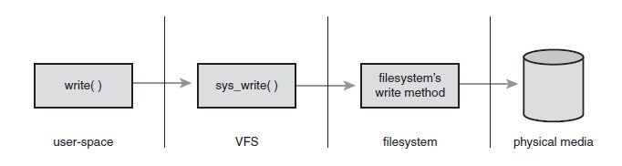
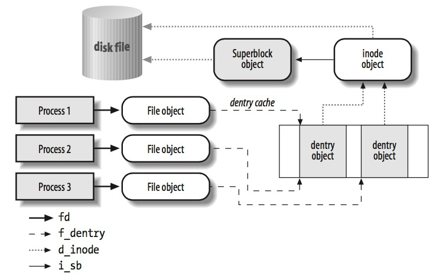

# LK Note 11
> SJTU-CS353 Linux Kernel

> Refer to the slides of Prof. Quan Chen, Dept. of CSE, SJTU.
## Lec 11. Virtual File System
### （1）虚拟文件系统概述
* VFS 位于系统调用之下，物理文件系统之上，是多种物理文件系统的通用接口
* VFS 支持磁盘文件系统（如 Ext2）、网络文件系统（如 NFS）、其它特殊文件系统（如 /proc）
* 一些术语
    * 目录（Directory），是一种特殊类型的文件，包含指向其它文件（包括目录）的 “指针”，目录连接在一起形成分层的命名空间
    * 元数据（Metadata），描述文件的信息
    * 索引节点（Inode），与文件一一对应，具有唯一性，保存与文件有关的文件属性和数据块的位置，存放在硬盘中（硬盘上的索引节点）
    * 数据块（Data Blocks），包含文件数据，在物理上可能不是连续的
* 通用文件模型
    * 定义通用文件模型接口和相关的数据结构
    * 要实现某个具体的文件系统，必须将其物理组织结构转换为虚拟文件系统的通用文件模型
    * 面向对象：数据 + 方法（Linux 内核软件对象，存放在内存中）
        * **superblock**（超级块对象）：一个挂载的文件系统
        * **inode**（索引节点对象）：文件元数据，唯一标识文件系统中的文件
        * **file**（文件对象）：与进程进行交互的信息
        * **dentry**（目录项对象）：目录条目，路径名的单个组件

* 进程与文件的交互

* 虚拟文件系统的操作
    * `super_operations`：在特定文件系统上调用
    * `inode_operations`：在特定（指向文件的）索引节点上调用
    * `dentry_operations`：在特定目录项上调用
    * `file_operations`：在文件上调用
* 底层文件系统对上述函数实现自己的版本，需要时虚拟文件系统调用该版本；若底层文件系统未定义，则虚拟文件系统调用该方法的通用版本

### （2）虚拟文件系统的数据结构
#### 【 superblock 对象】
* 由每个文件系统实现，描述特定文件系统信息
* 物理位置通常在每个分区开头 —— 文件系统控制块
* <linux/fs.h> **`struct super_block`**
    * `struct super_operations *s_op;` 超级块操作
    * `struct dentry *s_root;` 挂载目录
    * `unsigned char s_dirt;` dirty flag，整个文件系统是否有文件被修改
    * ... ...
#### 【 inode 对象】
* 操作文件/目录所需的所有信息
* 在内存中创建（大多从硬盘索引节点中直接读入）
* 超级块对象对应 3 个双向循环链表：
    * 没有被任何进程使用的 inode 链表
    * 当前被某些进程使用的 inode 链表
    * 脏 inode 链表
* <linux/fs.h> **`struct inode`**
    * `struct inode_operations *i_op;` 索引节点操作
    * `struct list_head i_dentry;` 目录项列表
    * `atomic_t i_count;` 引用计数
    * `struct super_block *i_sb;` 关联的超级块
    * ... ...
#### 【dentry 对象】
* VFS 把每个目录看作若干子目录和文件组成的普通文件
* `/bin/vi` 包括 3 个 dentry 对象：`/`，`bin`，`vi`，都是文件，对应一个 inode
* <linux/dcache.h> **`struct dentry`**
    * `struct dentry_operations *d_op;` 目录项操作
    * `atomic_t d_count;` 使用计数（多少进程正在访问该对象）
    * `struct inode *d_inode;` 关联的索引节点
    * ... ...
* dentry 对象状态
    * `Free`
        * 没有分配 inode 对象
    * `Unused`
        * 分配了有效 inode 对象（`->d_inode` 指向对应 inode 对象）
        * 用户数量为 0（`->d_count` 为 0 ，没有进程通过该 dentry 对象访问文件）
        * 由于指向了有效 inode 对象，它放在高速缓存中（更快地进行路径查找，必要时被丢弃以回收内存）
    * `In use`
        * 分配了有效 inode 对象
        * 用户数量 > 0
        * 由于正在被使用，不能从高速缓存中释放
    * `Negative`
        * 分配了无效 inode 对象（`->d_inode` 为 NULL）
        * 可能原因：程序尝试打开不存在的文件；该文件的索引节点被删除
        * 可能被保存在目录项高速缓存中
* 目录项高速缓存
    * 存储目录项对象
    * 包括三个部分：
        * `In use` 目录项双向链表
        * LRU 的 `Unused` 和 `Negative` 目录项双向链表
        * 散列表（哈希函数），快速解析给定路径的目录项对象
#### 【File 对象】
* 表示一个被进程打开的文件：在进程打开时创建 File 对象，放在内存中
* File 对象通过名为 flip 的 slab 缓存分配
* <linux/fs.h> **`struct file`**
    * `struct file_operations *f_op;` 文件操作
    * `struct dentry *f_dentry;` 与文件关联的目录项对象
    * `unsigned int f_flags;` 打开文件标志
* 文件相关的系统调用
* 进程描述符 `task_struct` 中的：
    * `struct fs_struct *fs;` 指向当前目录
    * `struct files_struct *files;` 指向文件描述符
        * `files->fd` 文件描述符
            * `fd[0]：stdin`
            * `fd[1]：stdout`
            * `fd[2]：stderr`
        * `NR_OPEN` 一个进程的文件描述符最大数量

### （3）文件系统的类型
* 特殊文件系统，例如：
    * `/proc`：对内核数据结构的访问点
    * `/sys`：对系统数据的访问点
* 文件系统类型的注册
    * VFS 通过此来跟踪内核所包含的文件系统类型
    * 文件系统类型对象 `File_system_type`
    * 所有的 `File_system_type` 对象被插入到一个单向链表中

### （4）文件系统的管理
> **挂载（mount）**：操作系统将存储设备分区挂载到某个目录（挂载点）下，用户可以通过访问该目录访问存储在设备上的文件

* 根文件系统，/proc 虚拟文件系统是根文件系统的子节点
* 命名空间：Linux 2.6 中，每个进程都有自己的挂载文件系统树
* 文件系统的安装与卸载
    * 挂载一个 ext2 类型的文件系统，其物理位置在 /dev/fd0，挂载点在 /flp 目录
        * `mount -t ext2 /dev/fd0 /flp`
    * Linux 可以多次安装相同的文件系统，但始终只有一个超级块对象（与文件系统一一对应）
    * 已安装文件系统描述符：类型 `vfsmount`
    * 安装过程：
        * ① 调用 `path_lookup()` 查找挂载点路径名；② 检查挂载标志，确定必须执行的操作；③ `do_kern_mount()`；④ 终止挂载点的路径名查找；⑤ 返回
    * 卸载过程：
        * ① 调用 `path_lookup()` 查找挂载点路径名；② 检查正确性和优先级；③ `do_unmount()`；④ 减少相应的计数器；⑤ 返回

### （5）路径查找
* 目标：路径名 -> 索引节点
* 难点：检查每个目录的访问权限，符号链接（可能引发循环引用），文件名可以是已安装文件系统的挂载点，路径查找必须在发出系统调用的进程的命名空间内完成
* 分析路径名，将其分解为一系列文件名
    * 绝对路径：从 `current->fs->root` 开始
    * 相对路径：从 `current->fs->pwd` 开始
    * `path_lookup()` 返回 `nameidata` 结构
        * `struct dentry *dentry;` ：目录项对象
        * `struct vfs_mount *mnt;` ：路径名中最后一个已解析组件的、已安装文件系统对象
    * 查找操作真正目标，是倒数第二个组件，最后一个不会被解释
    * 符号链接：必须在继续进行原始路径查找之前，对符号链接进行解释

### （6）文件加锁
* 劝告锁：基于 `fcntl()` 系统调用，可以锁定文件的任意区域
    * 非强制，实际上其它进程仍然可以读写
* 强制锁：内核检查每个系统调用，确保每个操作不能违反强制锁
* Linux 支持对整个文件、文件的某一部分进行加锁

