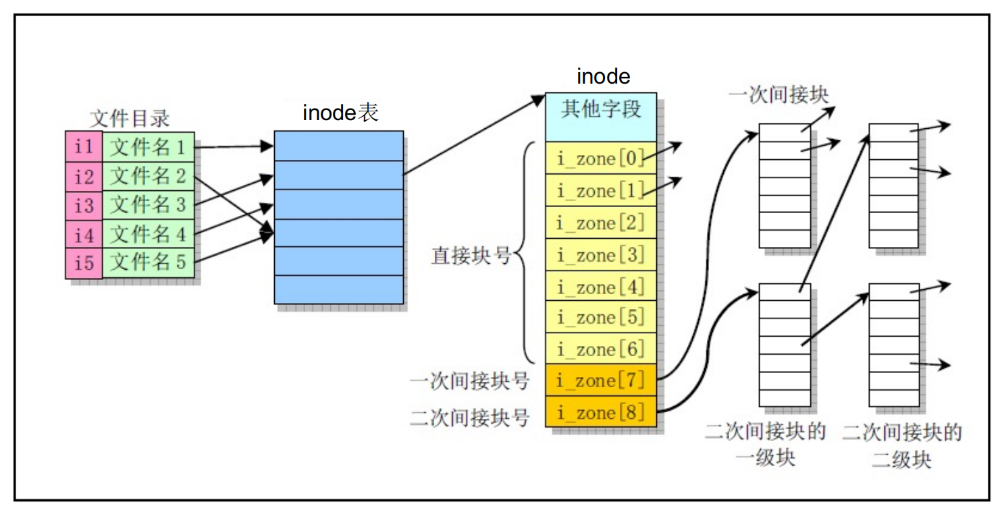

# LK Note 12
> SJTU-CS353 Linux Kernel

> Refer to the slides of Prof. Quan Chen, Dept. of CSE, SJTU.
## Lec 12. Linux File System Implementations
* Linux 文件系统发展：Minix (0.11) -> Ext -> Ext2 (2.4) -> Ext3 -> Ext4
* 硬盘上的分区：主引导扇区、FAT32、NTFS、MINIX、EXT2

### Minix 文件系统
* **Minix 文件系统组成**
    * **引导块**（Boot Block）
    * **超级块**（Super Block）
    * **Inode 位图**（Inode Bitmap）
    * **数据块位图**（Data Block Bitmap）
    * **Inode 表**（Inode Table）
    * **数据区盘块**（Data Block）
* Minix 文件系统的源代码在 0.11 内核的 `linux/fs` 目录下
* SuperBlock / Inode 数据结构包括：磁盘和内存共有字段（内存超级块由磁盘导入）、内存特有字段
* **Inode 的 `i_mode` 字段**
    * 保存文件类型、访问权限属性
    * short 类型，2 B
    * 字符设备文件 —— 键盘、鼠标；块设备文件 —— 磁盘
    * 执行时设置用户 ID 举例：
    
        > 普通用户对文件 `/etc/passwd` 没有 write 权限，但是可以通过 `passwd <user>` 修改密码，这一操作写了 `/etc/passwd` 文件。原因是，`/etc/passwd` 文件的属主是 root，对该文件有写权限，并且设置了执行时设置用户 ID 的标志位，这样普通用户在执行 `passwd` 程序时，是以 root 身份打开该文件的，因此也有了 write 的权限，但实际上这一权限是受控的，用户只能修改自己的密码，不能查看和修改别人的密码。

<p align="center"></p>

* **Inode 的 `i_zone[9]` 字段**
    * 文件的混合索引分配
    * `i_zone[0] - i_zone[6]` 存放文件开始的 7 个磁盘块号 —— **直接块**
    * `i_zone[7]` 存放 512 个磁盘块号，寻址 512 个磁盘块 —— **一级间接块**
    * `i_zone[8]` 存放 512×512 个磁盘块号，寻址 512×512 个磁盘块 —— **二级间接块**
    * 文件的最大大小 = (7 + 512 + 512×512) × 1 KB =  256.5 MB（假设磁盘块大小为 1 KB）

<p align="center"></p>

* **文件类型和属性：`ls -l`**

<p align="center"></p>

* **目录项结构（Dentry）**
```c
#define NAME_LEN 14
#define ROOT_INO 1

struct dir_entry {
    unsigned short inode; // inode 号
    char name[NAME_LEN];  // 文件名
}
```

<p align="center"></p>

* **`hexdump` 查看目录项数据块**
    * `hexdump .` 当前目录
* **Linux 文件系统底层函数** —— 文件系统自身管理（分配 inode/盘块...）

<p align="center"></p>

<p align="center"></p>

* **Linux 文件系统数据访问操作**
    * 顶层 —— 文件读写系统调用：`read_write.c`
    * 底层 —— 块设备、普通文件、字符设备、管道设备的读写
        * 块设备：`block_dev.c`
        * 普通文件：`file_dev.c`
        * 字符设备：`char_dev.c`
        * 管道设备：`pipe.c`

<p align="center"></p>

<p align="center"></p>

* **文件访问模式 `f_mode`**

<p align="center"></p>

* **进程打开文件使用的内核数据结构**

<p align="center"></p>

* **Linux 文件系统上层函数** —— 文件和目录系统调用，面向应用层

<p align="center"></p>

<p align="center"></p>

* **高速缓冲区**
    * `Buffer.c` 用于对高速缓冲区进行操作和管理
    * 缓冲头 `Buffer_head` -> 缓冲块（一个磁盘块大小）

<p align="center"></p>

<p align="center"></p>

* 缓冲头组成的 LRU 双向循环链表（空闲表指针 `b_prev_free/b_next_free`）

<p align="center"></p>

* 缓冲区 Hash 队列（Hash 表项指针 `b_prev/b_next`）

<p align="center"></p>

* 块设备访问操作
<p align="center"></p>

* **Ext2 文件系统**
<p align="center"></p>